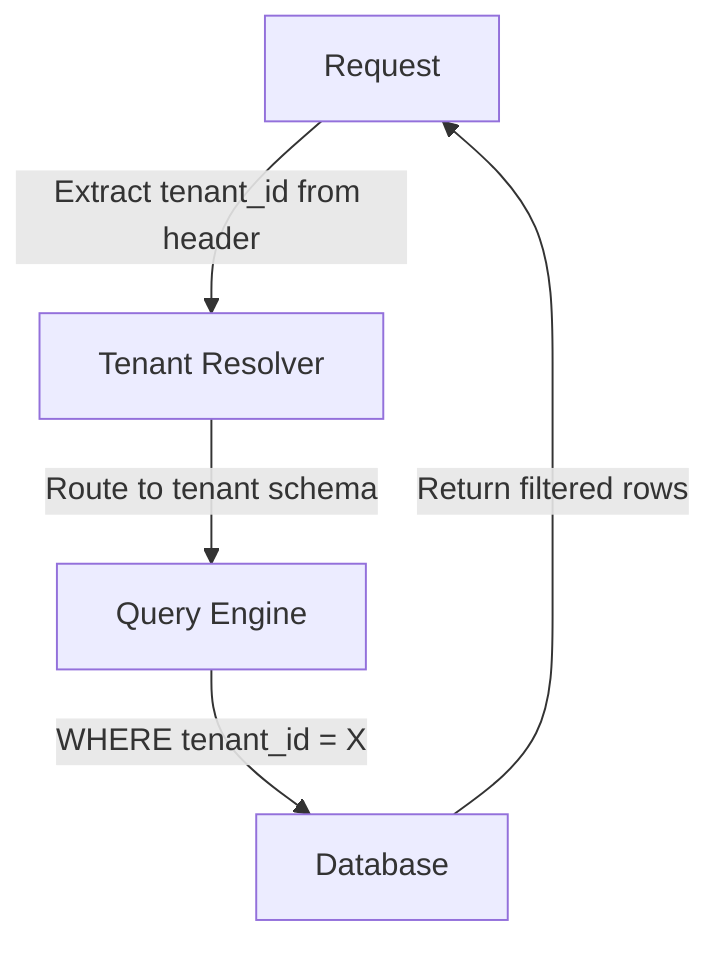
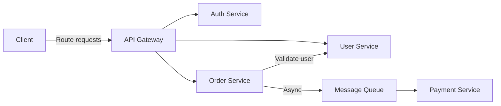
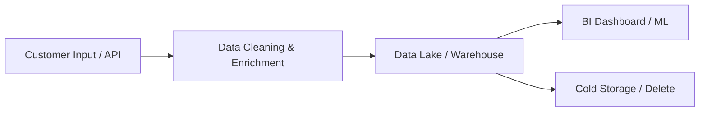

# Enterprise Domain Mode: SOC 2 & Multi-Tenant Systems (v6)

**Activation**: Score ≥ 15 | **Confidence**: ≥ 50% | **Focus**: SOC 2 compliance, IAM patterns, multi-tenancy, audit trails, microservices

This mode provides comprehensive documentation patterns for enterprise-grade codebases prioritizing security, scalability, regulatory audit, multi-customer isolation, and sophisticated access control. Focus areas include SOC 2 compliance mapping, identity & access management, multi-tenant architectures, audit trails, microservice topology, and data governance.

## Table of Contents

1. [SOC 2 Compliance Mapping](#soc-2-compliance-mapping)
2. [Identity & Access Management](#identity--access-management)
3. [Multi-Tenancy Architecture](#multi-tenancy-architecture)
4. [Audit Trail & Logging](#audit-trail--logging)
5. [Microservice Architecture](#microservice-architecture)
6. [Infrastructure & DevOps](#infrastructure--devops)
7. [Data Governance](#data-governance)
8. [Compliance Checklist](#compliance-checklist)

---

## SOC 2 Compliance Mapping

SOC 2 Trust Service Criteria define control objectives across five trust domains. Map discovered code patterns to these criteria.

### The Five Trust Domains

| Domain | Focus | Code Patterns | Documentation Approach |
|--------|-------|---------------|------------------------|
| **CC (Common Criteria)** | Security controls | Auth decorators, encryption middleware, API key validation | Document identity verification flows, privilege escalation paths |
| **A1 (Availability)** | System uptime, disaster recovery | Health checks, load balancing, backup scripts, failover logic, circuit breakers | Map redundancy levels, RTO/RPO targets, incident response |
| **PI1 (Processing Integrity)** | Data quality, accuracy, completeness | Input validation, transaction logging, error handlers, data reconciliation | Track data quality gates, error recovery paths, validation |
| **C1 (Confidentiality)** | Data encryption, access restriction | Encryption-at-rest config, TLS certificates, field-level encryption, masking | Classify data by sensitivity; document encryption & rotation |
| **P1-P8 (Privacy)** | Data handling, user rights | Consent flows, data retention policies, Right to Erasure, consent audit logs | Detail consent capture, retention schedules, deletion workflows |

### Compliance Status Matrix

For each domain, document:

```markdown
## {{DOMAIN}} Compliance Status

| Requirement | Control Name | Code Location | Status | Evidence |
|---|---|---|---|---|
| CC6.1 | Logical Access Control | `auth_middleware.py:42` | Implemented | Signature verification enforced |
| CC7.1 | System Monitoring | `logging/audit.py:100` | Implemented | Cloudwatch integration active |
| A1.1 | Availability Objectives | `config/rto.yaml` | Implemented | RTO: 15 min, tested quarterly |
| PI1.1 | Data Completeness | `validators/data_integrity.py` | Implemented | 99.9% validation success |
| C1.1 | Encryption at Rest | `database/encryption.py:15` | Implemented | AES-256-GCM |
| P1.1 | Privacy Notice | `docs/privacy_policy.md` | Implemented | Updated Q4 2025 |

**Compliance Score**: 6/6 implemented (100%)
```

---

## Identity & Access Management

### Role-Based Access Control (RBAC)

Locate role definitions and permission assignments:

```javascript
const ROLES = {
  admin: {
    permissions: ['read', 'write', 'delete', 'audit'],
    inherits: ['editor']
  },
  editor: {
    permissions: ['read', 'write'],
    inherits: ['viewer']
  },
  viewer: {
    permissions: ['read']
  }
};
```

**Documentation Focus**:
- Role definitions and inheritance hierarchy (create table/diagram)
- Permission matrix showing which roles can perform which actions
- Route/endpoint protection patterns
- Database-level row filtering by user role

**Template**:

```markdown
## Role Hierarchy

graph TD
    Admin[Admin] -->|inherits| Editor[Editor]
    Editor -->|inherits| Viewer[Viewer]
    Viewer -->|inherits| Guest[Guest]

## Permission Matrix

| Role | Read | Write | Delete | Audit |
|---|---|---|---|---|
| Admin | ✓ | ✓ | ✓ | ✓ |
| Editor | ✓ | ✓ | | |
| Viewer | ✓ | | | |
| Guest | | | | |
```

---

### Attribute-Based Access Control (ABAC)

ABAC policies evaluate context beyond static roles:

```javascript
const policies = [
  {
    resource: 'financial_report',
    action: 'read',
    conditions: [
      { attribute: 'user.department', operator: 'eq', value: 'finance' },
      { attribute: 'time.hour', operator: 'gte', value: 9 },
      { attribute: 'user.location', operator: 'in', values: ['office', 'vpn'] }
    ]
  }
];
```

**Documentation Focus**:
- Attribute sources: user, resource, environment, action, time
- Policy definitions and evaluation logic
- Policy Decision Point (PDP) location in codebase
- Policy Enforcement Point (PEP) at API boundaries

---

### SSO / SAML / OAuth Integration

Identify identity provider integrations:

```javascript
// SAML service provider config
module.exports = {
  sp: {
    entityID: 'https://app.company.com/metadata/',
    assertionConsumerServiceURL: 'https://app.company.com/saml/acs',
    singleLogoutServiceURL: 'https://app.company.com/saml/sls'
  },
  idp: {
    entityID: 'https://idp.company.com',
    singleSignOnService: { url: 'https://idp.company.com/sso' },
    singleLogoutService: { url: 'https://idp.company.com/sls' }
  }
};
```

**Documentation Focus**:
- IdP provider (Okta, Auth0, Azure AD, PingFederate)
- OAuth 2.0 flow type (authorization code, client credentials, refresh token)
- OIDC configuration and user attribute mapping
- Token validation and refresh logic
- Multi-tenant IdP configuration (if applicable)

**Template**:

```markdown
## SSO Configuration

| IdP | Protocol | Token Lifetime | Refresh | MFA Required |
|---|---|---|---|---|
| Okta | SAML 2.0 | 60 min | Yes (90 days) | Conditional |
| Azure AD | OAuth 2.0 | 60 min | Yes (14 days) | Yes |
```

---

### Multi-Factor Authentication (MFA)

Locate MFA implementation:

```javascript
if (loginRiskScore > 0.7 || user.requires_mfa) {
  // Trigger MFA challenge
  await sendMFAChallenge(user.phone, 'sms');
}
```

**Documentation Focus**:
- MFA methods supported (TOTP, SMS, push notification, hardware token, biometric)
- Backup codes and account recovery flows
- Conditional MFA logic (risk scoring, IP reputation, geolocation)
- MFA bypass scenarios and attestation
- MFA enforcement policy (mandatory for privileged accounts, optional for users)

---

## Multi-Tenancy Architecture

Identify the tenancy model used:

| Model | Pattern | Isolation Level | Data Leakage Risk | Cost |
|-------|---------|-----------------|-------------------|------|
| **Database per Tenant** | Separate DB instance per customer | Strongest | Very Low | Highest |
| **Schema per Tenant** | Single DB, separate schemas, routed at connection | Strong | Low | Medium |
| **Row-level Isolation** | Shared tables, `tenant_id` on every row, filtered in queries | Moderate | Medium (filter bypass) | Lowest |
| **Hybrid** | Different models for different data types | Varies | Varies | Varies |

**Documentation Steps**:

1. **Identify tenant resolution logic**:
   - URL subdomain (e.g., `acme.app.com`)
   - HTTP header (e.g., `X-Tenant-ID`)
   - URL path (e.g., `/tenants/acme/`)
   - JWT claim (e.g., `sub: tenant_123`)

2. **Map data routing**:
   - Which tables/schemas belong to which tenants
   - Tenant affinity (colocated or separated)

3. **Document tenant isolation boundaries**:



4. **List all queries and verify tenant filtering**:

```python
# ✓ CORRECT: Tenant filter enforced
@app.get("/api/documents")
def list_documents(tenant_id=Depends(get_current_tenant)):
    return db.query(Document).filter(Document.tenant_id == tenant_id).all()

# ✗ WRONG: No tenant filter (data leakage risk)
@app.get("/api/documents")
def list_documents():
    return db.query(Document).all()  # Returns ALL documents from ALL tenants
```

5. **Document tenant onboarding/offboarding**:
   - Tenant provisioning (new database, schema, or initial row)
   - Tenant deletion (cascade delete or anonymization)
   - Tenant data export/migration

---

## Audit Trail & Logging

Enterprise audit requirement: **Who did what, when, from where.**

### Core Audit Attributes

```python
audit_entry = {
    'timestamp': datetime.utcnow().isoformat(),  # When
    'user_id': 'user_123',  # Who
    'action': 'UPDATE',  # What (READ, CREATE, UPDATE, DELETE)
    'resource_type': 'Customer',  # Object type
    'resource_id': 'cust_456',  # Specific object
    'ip_address': '192.168.1.100',  # From where
    'tenant_id': 'tenant_789',  # Multi-tenant context
    'status': 'SUCCESS',  # Outcome
    'details': {
        'before': { 'status': 'ACTIVE' },  # Before/after for changes
        'after': { 'status': 'SUSPENDED' }
    }
}
```

### Implementation Patterns

**Middleware-based audit logging**:
```javascript
app.use(auditMiddleware((req, res, next) => {
  auditLog({
    user_id: req.user.id,
    action: req.method + ' ' + req.path,
    resource: req.body.resource_id,
    timestamp: new Date().toISOString(),
    ip_address: req.ip,
    status: res.statusCode,
    details: {
      before: req.body.before,
      after: req.body.after
    }
  });
  next();
}));
```

**Event sourcing** (immutable event store):
```javascript
eventStore.append({
  eventId: uuid(),
  aggregateId: resourceId,
  eventType: 'ResourceUpdated',
  data: { fields: updatedFields },
  metadata: { userId, timestamp, causationId, tenant_id }
});
```

### Documentation Focus

- Audit log schema and retention policy (minimum 1–3 years, often state-dependent)
- SIEM integration points (Splunk, ELK, Datadog, CloudTrail, Sumologic)
- Immutability guarantees and tamper detection (append-only, hashing, signatures)
- Log aggregation and centralized storage
- Audit evidence for compliance reviews (export, filtering, search)

---

## Microservice Architecture

When codebase spans multiple independent services, document:

### Service Topology



**Documentation for Each Service**:
- Service name, responsibility, team owner
- Port/gRPC address
- Key dependencies (internal and external APIs)
- Data ownership (database tables, caches)
- Synchronous vs. asynchronous communication
- Service discovery mechanism (Eureka, Consul, Kubernetes)

### Communication Patterns

| Pattern | Use Case | Example | Trade-offs |
|---------|----------|---------|-----------|
| **Sync REST** | Request-response, low latency | `GET /api/users/{id}` | Tight coupling, must be available |
| **gRPC** | High-performance, structured | `.proto` service definitions | Not HTTP/browser-friendly |
| **Async Messaging** | Decoupled, eventual consistency | RabbitMQ, Kafka topics | Eventual consistency, more complex |
| **Service Mesh** | Observability, security (mTLS) | Istio, Linkerd, Consul Connect | Operational overhead |

### Distributed Tracing

Locate OpenTelemetry or Jaeger instrumentation:

```javascript
const tracer = sdk.getTracer('my-service');
const span = tracer.startSpan('processOrder', {
  attributes: { 'service.name': 'order-service' }
});
span.addEvent('order_validated');
span.end();
```

**Documentation Focus**:
- Trace ID propagation across services (headers, context)
- Span naming conventions
- Baggage (context) passed between services
- Jaeger/Datadog collector endpoints

### Resilience Patterns

```javascript
// Circuit breaker: stop calling failing service
const circuitBreaker = new CircuitBreaker(
  () => paymentServiceCall(),
  { threshold: 5, timeout: 60000 }  // Fail after 5 errors in 60s
);

// Retry with exponential backoff
await retry(() => apiCall(), { maxAttempts: 3, backoff: 'exponential' });

// Bulkhead: limit concurrent calls
const bulkhead = new Semaphore(10);
await bulkhead.acquire(() => serviceCall());
```

**Documentation**: Failure modes, recovery mechanisms, timeouts, and SLAs for each service boundary.

---

## Infrastructure & DevOps

### Kubernetes & Orchestration

Document if present:
- **Helm charts** for templating deployments
- **Kustomize** for environment-specific overlays
- **Pod security policies**, network policies
- **StatefulSet** vs. **Deployment** usage
- **Resource limits** (CPU, memory, requests)
- **Autoscaling** policies (HPA, VPA)

**Template**:
```yaml
# Example: Helm values for production
deployment:
  replicas: 3
  image: myapp:v1.2.3
  resources:
    requests:
      cpu: 500m
      memory: 512Mi
    limits:
      cpu: 1000m
      memory: 1Gi
  autoscaling:
    minReplicas: 3
    maxReplicas: 10
    targetCPUUtilization: 70%
```

---

### Infrastructure as Code

Map configuration management:
- **Terraform**: Module structure, state management, provider configuration, remote state
- **CloudFormation**: Stack organization, parameter handling, nested stacks
- **Pulumi**: Program structure, stack references, secrets management

**Documentation Focus**:
- Module dependencies and structure
- Environment management (dev/staging/prod)
- Secrets handling (never in code, use Secrets Manager)
- State file protection (encryption, version control, access logs)

---

### CI/CD Pipelines

**Example: GitHub Actions**:
```yaml
pipeline:
  test:
    - lint
    - unit-test
    - integration-test
  build:
    - docker-build
    - scan-image (trivy, snyk)
  deploy:
    - staging-deploy
    - approval-gate
    - prod-deploy (canary rollout)
```

**Documentation**:
- Trigger conditions (branch, tag, schedule, manual)
- Approval gates and required reviewers
- Environment variables and secrets management
- Artifact storage and retention (registry, versioning, expiration)
- Rollback procedures

---

### Environment Management

Identify and document:
- **Development**: Local, feature branches, quick feedback loops
- **Staging**: Pre-production, load testing, UAT, user acceptance testing
- **Production**: Live customer environment, hardened, monitored
- **Disaster Recovery**: Hot standby, RTO/RPO targets, failover procedures

---

### Secret Management

Locate secrets infrastructure:
- **HashiCorp Vault**: AppRole auth, TTL policies, dynamic secrets
- **AWS Secrets Manager**: Secret rotation, resource-based policies, cross-account access
- **Azure Key Vault**: Managed identity access, policy separation
- **Sealed Secrets / SOPS**: GitOps-friendly encryption

**Documentation**:
- Secret rotation frequency (max 90 days for privileged credentials)
- Access audit trails (who accessed which secrets, when)
- Secret versioning and revocation

---

### Monitoring & Alerting

```javascript
const httpRequestDuration = new prometheus.Histogram({
  name: 'http_request_duration_seconds',
  help: 'Duration of HTTP requests in seconds',
  labelNames: ['method', 'route', 'status']
});
```

**Golden Signals** (key metrics):
- **Latency**: P50, P95, P99 response times
- **Traffic**: Requests per second (RPS)
- **Error Rate**: Failed requests (4xx, 5xx)
- **Saturation**: CPU, memory, disk, queue depth

**Documentation Focus**:
- Key metrics and dashboard URLs
- Alert rules and thresholds (e.g., "alert if error rate > 5%")
- On-call rotations and escalation paths
- Alerting channels (PagerDuty, Opsgenie, Slack)
- Post-mortem process for incidents

---

## Data Governance

### Data Classification

Establish and document sensitivity levels:

| Level | Examples | Controls | Encryption |
|-------|----------|----------|-----------|
| **Public** | Blog posts, marketing | No encryption required | No |
| **Internal** | Employee docs, meeting notes | Restricted to employees | Optional |
| **Confidential** | Customer data, contracts | Encryption, access audit | At rest + transit |
| **Restricted** | Payment cards, SSN, API keys | PII masking in logs, vault storage | At rest + transit + key vault |

**Code Pattern**:
```python
data_classification = {
    'user_email': 'INTERNAL',
    'user_password_hash': 'RESTRICTED',
    'user_name': 'CONFIDENTIAL',
    'user_ip_address': 'CONFIDENTIAL',
    'audit_log': 'INTERNAL',
    'api_key': 'RESTRICTED'
}
```

---

### Data Lineage

Document data flow from source to archive:



---

### Data Retention & Disposal

Map retention policies to data types:

```javascript
const retentionPolicy = {
  'user_profiles': '7 years',
  'transaction_logs': '10 years',
  'session_tokens': '30 days',
  'debug_logs': '30 days',
  'audit_logs': '3 years minimum',
  'gdpr_deletion_requests': 'immediate (30 days grace)'
};
```

---

### GDPR/CCPA Compliance

Scan for implementations:

| Right | Implementation | Code Location |
|------|---|---|
| **Right of Access** | Query builder to retrieve user data | `api/users/{id}/export` |
| **Right to Erasure** | Anonymization or deletion workflows | `tasks/gdpr_deletion.py` |
| **Right to Portability** | Data export in JSON/CSV format | `api/users/{id}/data-export` |
| **Consent Management** | Checkbox capture and audit logging | `consent_manager.py` |
| **Data Processing Agreements** | Map to controllers, processors, sub-processors | `docs/dpa.md` |

---

## Compliance Checklist

Use this checklist when analyzing a codebase for enterprise readiness:

- [ ] **SOC 2 Mapping**: All CC, A1, PI1, C1, P1-P8 controls identified and mapped to code
- [ ] **Authentication**: SSO/SAML/OAuth integration documented; IdP provider specified
- [ ] **Authorization**: RBAC role matrix created; ABAC policies identified if present
- [ ] **MFA**: MFA methods supported; enforcement policy documented; backup codes present
- [ ] **Multi-tenancy**: Tenancy model confirmed (database/schema/row-level); isolation boundaries documented
- [ ] **Audit Trail**: Audit logging middleware identified; retention policy (≥ 1 year); SIEM integration documented
- [ ] **Immutability**: Audit logs append-only; tamper detection enabled
- [ ] **Microservices**: Service topology diagram created; communication patterns mapped
- [ ] **Distributed Tracing**: OpenTelemetry/Jaeger instrumentation present; trace context propagated
- [ ] **Infrastructure**: Kubernetes config, IaC modules, CI/CD pipelines documented
- [ ] **Secrets**: Secret management approach identified; rotation policies (≤ 90 days) documented
- [ ] **Monitoring**: Golden signals (latency, traffic, error rate, saturation) identified
- [ ] **Alerting**: Alert rules and thresholds defined; on-call process documented
- [ ] **Data Classification**: Sensitivity levels defined; encryption by level documented
- [ ] **Retention Policies**: Data retention (min 1–3 years) and disposal procedures documented
- [ ] **Privacy Controls**: Consent flows, Right to Erasure, data export mechanisms identified
- [ ] **Compliance Gaps**: Gaps flagged; remediation priorities set

---

**References**: SOC 2 Trust Service Criteria, NIST Cybersecurity Framework, CIS Controls, AWS Security Best Practices, Kubernetes Security Best Practices, OWASP Top 10
