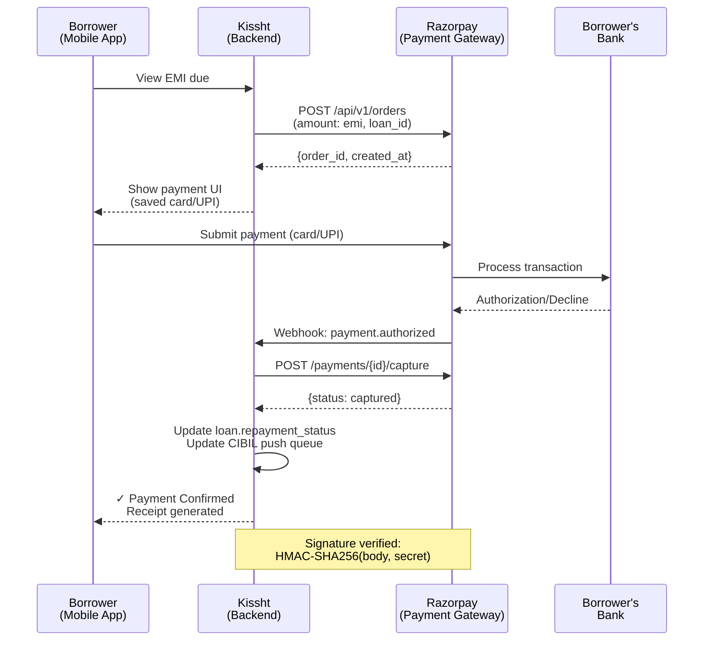
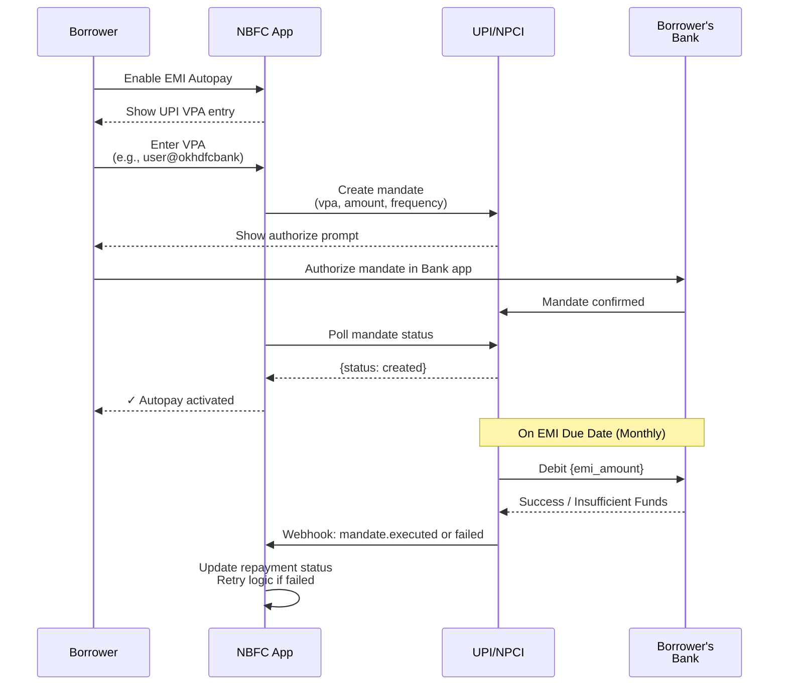
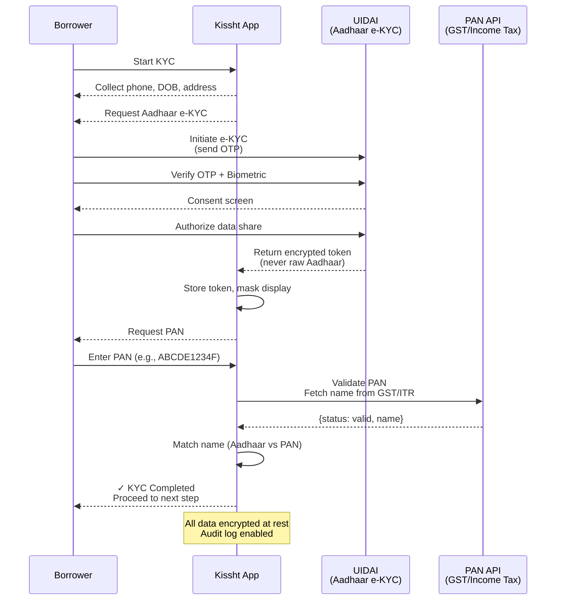
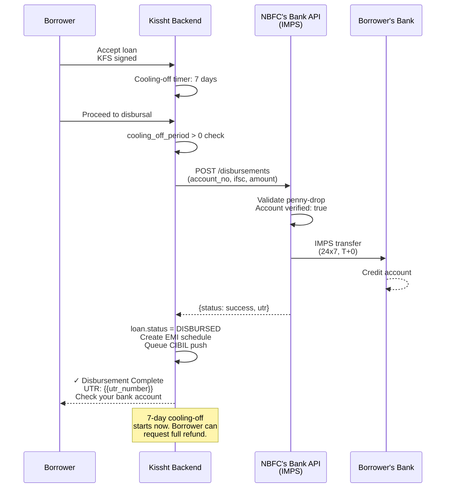

# Fintech Domain Mode: Indian NBFC Digital Lending (v6)

**Activation**: Score ≥ 15 | **Confidence**: ≥ 50% | **Focus**: Indian fintech, RBI-regulated, payment ecosystems, PII protection

This mode provides comprehensive documentation patterns for Indian digital lending platforms with emphasis on regulatory compliance, payment ecosystems, PII protection, and lending-specific state machines. Focus area is Indian NBFC platforms (like Kissht), not US/EU fintech.

**All guidance assumes**: RBI-regulated entities, Indian payment gateways (Razorpay, Cashfree, UPI), Indian identity systems (Aadhaar, PAN, CIBIL).

## Table of Contents

1. [PCI-DSS Compliance Mapping](#pci-dss-compliance-mapping)
2. [RBI Regulatory Compliance](#rbi-regulatory-compliance)
3. [Indian Payment Ecosystem](#indian-payment-ecosystem)
4. [PII Inventory & Data Protection](#pii-inventory--data-protection)
5. [Lending-Specific Patterns](#lending-specific-patterns)
6. [Security Bypasses & Test Patterns](#security-bypasses--test-patterns)
7. [Payment Flow Documentation](#payment-flow-documentation)
8. [Compliance Checklist](#compliance-checklist)

---

## PCI-DSS Compliance Mapping

PCI-DSS (Payment Card Industry Data Security Standard) applies whenever the system handles cardholder data. In Indian fintech, this occurs during loan EMI collection or credit card bill payments.

**Why Critical**: PCI-DSS violations incur fines (₹10 lakh+ per incident in India). More critically, storing unencrypted card data exposes borrowers and violates RBI data protection norms.

### Indian Payment Gateway Architecture

In Indian fintech, **direct card storage is rare**. Most platforms use tokenization via payment gateways:

- **Razorpay**: Handles card tokenization; platform receives token, not raw card data
- **Cashfree**: Offers "Seamless Route" with merchant-managed tokens (requires PCI-DSS Level 2+)
- **PhonePe/Juspay**: Act as orchestration layers; card details never touch merchant backend

**Key Pattern**: Document the **integration pattern**, not raw card handling.

### PCI-DSS Requirements → Code Mapping

| Requirement | Code Pattern | Indian Fintech Context | Finding Template |
|---|---|---|---|
| 1. Firewall config | VPC security groups, API gateway rules | Verify no direct card endpoints exposed | `firewall_config: [✓/✗]` |
| 2. No defaults | Database passwords, API keys rotation | Check for hardcoded gateway credentials | `default_credentials: [✓/✗]` |
| 3. Cardholder data storage | Tokenization logic, payment request objects | Must use gateway tokens, never raw card | `cardholder_storage: [tokenized/raw/never]` |
| 4. Card data encryption (transit) | HTTPS/TLS configuration, payment API calls | Razorpay webhooks over HTTPS; verify signature | `transit_tls: [TLS1.2/TLS1.3]` |
| 5. Malware protection | Dependency scanning, code review process | Fintech apps targeted by card-stealing malware | `dependency_scan: [✓/✗]` |
| 6. Security patches | Dependency versions, framework updates | Critical for payment libraries | `patch_status: [current/outdated]` |
| 7. Access control | Payment service permissions, role-based endpoints | Card operations require explicit role | `payment_role_required: [✓/✗]` |
| 8. User authentication | OTP verification, session management | Card operations need strong auth (OTP + 2FA) | `card_2fa: [required/optional/missing]` |
| 9. Physical access | Not applicable (cloud-based) | Document AWS/GCP/Azure region compliance | `cloud_region: [India/Other]` |
| 10. Audit logging | Payment transaction logs, webhook logs | Every card operation must log (non-repudiation) | `payment_log_complete: [✓/✗]` |
| 11. Security testing | Card test transaction patterns, penetration tests | Identify test card usage; flag if in production | `test_cards_in_prod: [✓/✗]` |
| 12. Information security policy | Data retention policy, incident response | Document NBFC-specific policies | `policy_documented: [✓/✗]` |

### Payment Flow PCI-DSS Template

For each payment processing flow, document:

```markdown
## Payment Flow: {{FLOW_NAME}}

**Entry Point**: {{CONTROLLER/LAMBDA}}
**Gateway Used**: {{RAZORPAY/CASHFREE/UPI}}

### PCI-DSS Compliance Status

**Cardholder Data Handling**:
- [ ] Token-based (PCI-DSS L1 compliant)
- [ ] Direct card handling (requires Level 2+ audit)

**Data at Rest**: {{Encrypted / Tokenized / Never stored}}
**Data in Transit**: {{TLS 1.2+ / HTTPS verified}}
**Signature Verification**: {{Implemented / Missing / Hardcoded to true}}

**Findings**:
- Gap 1: {{Specific compliance gap}}
- Gap 2: {{Recommendation for remediation}}
```

---

## RBI Regulatory Compliance

The Reserve Bank of India (RBI) issued Digital Lending Guidelines (DLG) 2022 and Loan Service Provider (LSP) framework. These map directly to codebase requirements.

### Digital Lending Guidelines (DLG) 2022

**Requirement 1: Regulated Entity App Mandate**

Rule: Loan origination must occur through NBFC's own app/website, NOT via LSP (Loan Service Provider) app.

**Code Pattern to Document**:
```python
routing:
  POST /api/v1/loans/originate:
    required_origin: own_app  # Must verify request from Kissht app, not LSP partner
    context: borrower_id
    log_origination_channel: true
```

**Finding Template**: If routes allow external app origination, flag as RBI violation.

---

**Requirement 2: Key Fact Statement (KFS)**

Rule: Borrower must receive KFS (itemized loan terms) before disbursal. Must include: interest rate, processing fee, EMI amount, tenure, total cost.

**Code Pattern**:
```python
documents:
  kfs:
    required_before_disbursal: true
    fields:
      - principal_amount
      - interest_rate
      - processing_fee
      - total_interest
      - emi_amount
      - tenor_months
      - total_cost_of_credit
    signature_required: true
    format: pdf_with_digital_signature
```

**Finding**: If `kfs_generated` exists but disbursal can proceed without it, flag as RBI compliance gap.

---

**Requirement 3: Loan Service Provider (LSP) Disclosure**

Rule: All LSPs involved must be disclosed in writing to borrower.

**Code Pattern**:
```python
borrower_disclosures:
  - type: lsp_disclosure
    lsp_name: string
    lsp_function: enum[referral, kyc_collection, post_disbursement_support]
    consent_required: true
    signed: boolean
```

---

**Requirement 4: Cooling-Off Period**

Rule: Borrower has 7-day right to cancel loan after disbursement.

**Code Pattern**:
```python
loan_status_machine:
  DISBURSED:
    transition_to: COOLING_OFF_PERIOD
    valid_until: disbursement_date + 7.days
    borrower_can_exit: true
    penalty: none
```

**Finding**: If cooling-off logic missing or time-limited incorrectly, flag.

---

**Requirement 5: Grievance Redressal**

Rule: NBFC must have escalation matrix: Level 1 (customer service, 7-day SLA), Level 2 (regional head, 30-day SLA), Level 3 (ombudsman).

**Code Pattern**:
```python
grievances:
  escalation_matrix:
    level_1:
      team: customer_service
      resolution_sla: 7_days
      threshold: all_grievances
    level_2:
      team: regional_head
      resolution_sla: 30_days
      trigger: level_1_unresolved or escalation_request
    level_3:
      team: rbi_ombudsman
      trigger: level_2_unresolved
```

---

**Requirement 6: Data Localization**

Rule: All borrower data must be stored on servers physically located in India. Backup/analytics data: India-based only.

**Code Pattern**:
```python
database:
  regions:
    primary: ap-south-1  # AWS Mumbai
    backup: ap-south-1-secondary  # Same region
  analytics:
    location: india_only
    gdpr_processing: forbidden  # No EU transfer
```

**Critical Finding**: If database region is non-India (Singapore, US), **flag immediately as RBI violation**.

---

**Requirement 7: Phone Permissions Restriction**

Rule: App cannot access borrower's phone contacts, gallery, SMS without explicit informed consent. Cannot be required for loan processing.

**Code Pattern to Flag**:
```python
permissions:
  READ_CONTACTS:
    used_for: [referral_program]  # Must be optional
    required_for_kyc: false  # CANNOT be required
  READ_SMS:
    used_for: [otp_auto_fill]  # Auto-fill is OK
    required_for_kyc: false
```

---

### Further Loss Default Guarantee (FLDG) & Credit Bureau Reporting

**FLDG Rule**: If NBFC purchases FLDG insurance, maximum exposure is 5% of loan portfolio.

```python
portfolio_tracking:
  total_loans_disbursed: integer
  fldg_covered: integer
  fldg_ratio: float  # Must be <= 0.05
  monitoring: daily
```

**CIBIL Integration**: NBFCs must push monthly repayment data to CIBIL (and Equifax/Experian/CRIF HighMark).

```python
cibil_reporting:
  push_schedule: monthly (by 15th of next month)
  data_points:
    - account_open_date
    - monthly_payment_status: [0=on_time, 1=30_dpd, 2=60_dpd, 3=90_plus_dpd]
    - principal_outstanding
    - interest_outstanding
```

---

### Account Aggregator (AA) Framework

If platform uses AA framework to fetch bank statements for income verification:

```python
account_aggregator:
  role: FIU  # Financial Information User (the NBFC)
  flow:
    1. consent_capture  # Borrower grants consent in AA app
    2. consent_verification  # AA verifies consent is active
    3. data_pull  # NBFC pulls encrypted bank statements
    4. data_decryption  # NBFC decrypts using borrower's key
```

**Compliance Check**: Verify consent is active and refresh logic exists (AA consents expire).

---

## Indian Payment Ecosystem

Document payment systems the codebase integrates with. Each has different settlement timelines, error codes, compliance requirements.

### UPI (Unified Payments Interface)

**Architecture**:
- **VPA Format**: `username@bankname` (e.g., `borrower@okhdfcbank`)
- **Collect vs Pay**: Collect (merchant requests payment); Pay (customer initiates payment)
- **Settlement**: Real-time (T+0 for most banks)

**Code Patterns**:

```python
upi_integration:
  vpa_validation: /^[a-z0-9._-]+@[a-z]+$/i
  flow: collect  # For EMI auto-pay setup

  mandate_setup:
    type: autopay
    frequency: monthly
    amount: emi_amount
    failure_handling:
      retry_count: 3
      retry_days: [1, 3, 5]
```

**Webhook Handling**:
```
POST /webhooks/upi/mandate
X-Signature: HMAC-SHA256(body, secret_key)
{
  "mandate_id": "string",
  "status": "created|executed|failed|revoked",
  "timestamp": "ISO8601"
}
```

**Error Codes** (NPCI standard):
- `00`: Success
- `U69`: Insufficient funds (retry next day)
- `U24`: Invalid mandate (customer revoked; mark inactive)
- `U36`: Transaction timeout (schedule retry)

---

### Razorpay Integration

Most common payment gateway for Indian NBFC loan EMI collection.

**Order Flow**:

```python
order_creation:
  POST /api/v1/orders {
    amount: emi_amount,
    currency: INR,
    receipt: f"loan_{loan_id}_{installment_no}",
    notes: { borrower_id, loan_id }
  }
  → returns order_id

payment_capture:
  POST /api/v1/payments/{payment_id}/capture {
    amount: emi_amount,
    currency: INR
  }
  → updates payment status to captured

webhook_verification:
  event: payment.authorized | payment.failed
  signature: HMAC-SHA256(body, webhook_secret)
```

**Signature Verification Template** (CRITICAL):
```javascript
const crypto = require('crypto');
const hmac = crypto.createHmac('sha256', webhook_secret)
  .update(JSON.stringify(request.body))
  .digest('hex');

if (hmac !== request.headers['x-razorpay-signature']) {
  throw new Error('Webhook signature mismatch');
}
```

**Finding**: If signature verification missing or hardcoded to `true`, **flag as CRITICAL security gap**.

**Razorpay Routes** (marketplace):
```python
routes:
  account_transfer:
    source: razorpay_account  # Kissht's Razorpay account
    destination: lsp_account  # Loan referral partner's account
    percentage: 20  # 20% of payment to LSP
```

---

### Cashfree Integration

Cashfree offers "Seamless Route" where NBFC manages customer card tokens (requires PCI-DSS Level 2+).

**Settlement**: T+1 (next business day)
**Fees**: 2.25% + ₹5 per transaction (typical)

**Webhook**:
```json
POST /webhooks/cashfree
{
  "data": {
    "orderId": "loan_${loan_id}_${installment}",
    "orderStatus": "SUCCESS|FAILED|PENDING",
    "paymentMode": "UPI|CARD|NETBANKING"
  },
  "signature": "HMAC-SHA256(data_json, webhook_secret)"
}
```

---

### Traditional Banking for Disbursement

EMI collection via card/UPI, but loan disbursal typically uses bank transfer.

**IMPS** (Immediate Payment Service):
- Same-day, 24x7 settlement
- Max ₹2 lakh per transaction
- Used for urgent disbursals

**NEFT** (National Electronic Funds Transfer):
- Settlement in batches (half-hourly slots)
- No upper limit
- T+0 or T+1 depending on timing

**NACH** (National Automated Clearing House):
- For recurring EMI collection (auto-debit from borrower's account)
- Requires e-NACH mandate signed by borrower
- Settlement: Next working day

**Penny Drop Verification**:
```python
bank_account_validation:
  step_1: imps_transfer(amount: ₹1, description: "Verify account")
  step_2: borrower_provides_amount_received
  step_3: account_verified: true
  retention: Account details + timestamp
```

---

## PII Inventory & Data Protection

Personal Identifiable Information (PII) is the most sensitive data in fintech. RBI mandates strict controls on storage, access, and retention.

### PII Classification for Indian Fintech

| Category | Field | Sensitivity | Encryption | Retention |
|---|---|---|---|---|
| **Direct Identifier** | Aadhaar (12-digit) | HIGH | Tokenized only | 5 years post-KYC |
| | PAN (ABCDE1234F) | HIGH | Encrypted | 5 years post-KYC |
| | Bank Account | HIGH | Encrypted | 10 years (audit) |
| | IFSC | MEDIUM | Encrypted | 10 years |
| **Indirect Identifier** | Phone (+91 10 digits) | MEDIUM | Hashed (for matching) | 5 years |
| | Email | MEDIUM | Hashed | 5 years |
| | DOB (YYYY-MM-DD) | MEDIUM | Encrypted | 5 years |
| | Address | MEDIUM | Encrypted | 5 years |
| | Pincode (6-digit) | LOW | Encrypted | 5 years |
| **Financial Data** | Credit Score (CIBIL 300-900) | HIGH | Encrypted | Duration of loan |
| | Bank Statements | HIGH | Encrypted | 10 years (audit) |
| | Salary Slips | HIGH | Encrypted | 5 years |
| | ITR Data (AA) | HIGH | Encrypted | 5 years |
| | Loan History | HIGH | Encrypted | 5 years |
| **Biometric** | Selfie (Video KYC) | HIGH | Encrypted | 1 year after KYC |
| | Fingerprint | HIGHEST | Never store raw | Immediate delete |

### Aadhaar Handling Rules

**RBI and UIDAI regulations explicitly forbid storing raw Aadhaar numbers.**

**Compliant Approaches**:
1. **Virtual ID (VID)**: Request borrower's VID instead (ephemeral, regenerable)
2. **UIDAI e-KYC Token**: Use UIDAI's e-KYC service (returns encrypted token, not raw)
3. **Tokenization**: If raw Aadhaar collected during e-KYC, immediately replace with token

**Code Pattern**:
```python
aadhaar_handling:
  validation:
    format: /^\d{12}$/  # Verhoeff checksum
    storage_allowed: false

  compliant_methods:
    - virtual_id: /^\d{16}$/  # Preferred
    - uidai_token: /^[A-Za-z0-9]{32}$/

  display:
    format: "XXXX XXXX XXXX 1234"  # Mask all but last 4 digits

  audit_log: true  # Every access logged
```

**Critical Finding**: If raw Aadhaar appears in database, API responses, or logs, **flag as critical RBI violation**.

---

### Data Encryption Standards

**At Rest**: AES-256, key rotation every 90 days, keys in Secrets Manager (never hardcoded)

**In Transit**: TLS 1.2 minimum (TLS 1.3 preferred), certificate pinning for API calls to CIBIL/UIDAI/banks

**Code Pattern**:
```python
from cryptography.fernet import Fernet

cipher = Fernet(get_encryption_key())  # From Secrets Manager
encrypted_pan = cipher.encrypt(pan_number.encode())
db.save(pan=encrypted_pan)  # Store encrypted
```

---

### Data Retention Policy

Document for each data type:

```markdown
## Data Retention

| Data Type | Duration | Legal Basis | Deletion Method |
|---|---|---|---|
| PAN | 5 years after relationship ends | RBI KYC norms | Crypto-shred |
| Bank Statements | 10 years | RBI audit requirement | Retain |
| Loan Repayment Data | 5 years | RBI credit reporting | Anonymized (hash borrower_id) |
| Aadhaar Token | Duration of loan + 2 years | UIDAI retention | Securely delete |
```

---

## Lending-Specific Patterns

Digital lending involves specific lifecycle, terminology, and state machines.

### Loan Lifecycle State Machine

```
APPLICATION → UNDERWRITING → APPROVED → KFS_GENERATED → DISBURSED → ACTIVE → CLOSED/NPA
```

**Code Pattern**:
```python
loan_status_machine:
  APPLICATION:
    transition_to: UNDERWRITING
    on_event: kyc_complete AND cibil_fetched

  UNDERWRITING:
    transition_to: APPROVED
    on_event: approval_algorithm_passes

  APPROVED:
    transition_to: KFS_GENERATED
    on_event: customer_acceptance OR auto_transition_after_7_days

  KFS_GENERATED:
    transition_to: DISBURSED
    on_event: disbursal_request

  DISBURSED:
    transition_to: ACTIVE
    on_event: cooling_off_period_complete (7 days)
    cooling_off_exit: allow_full_refund_within_7_days

  ACTIVE:
    transition_to: CLOSED or NPA
    on_event: repayment_complete or 90_dpd_reached
```

---

### EMI Calculation (Reducing Balance Method)

```
EMI = P * [r(1+r)^n] / [(1+r)^n - 1]

where:
  P = Principal
  r = Monthly interest rate (annual_rate / 12 / 100)
  n = Number of months (tenor)

Example:
  principal: ₹1,00,000
  annual_rate: 12%
  tenor_months: 12
  monthly_rate: 0.001
  EMI: ₹8,884.88
```

**Code to Verify**:
```python
def calculate_emi(principal, annual_rate, tenor_months):
    monthly_rate = annual_rate / 12 / 100
    emi = principal * monthly_rate * (1 + monthly_rate)**tenor_months / \
          ((1 + monthly_rate)**tenor_months - 1)
    return round(emi, 2)
```

**Finding**: If EMI calculation differs from standard formula, check for rounding errors that benefit NBFC.

---

### NPA Classification

Non-Performing Asset (NPA) classification follows RBI norms:

| Days Past Due | Classification | Code Pattern |
|---|---|---|
| 0-30 | SMA-0 (Special Mention Account) | `status = SMA_0` |
| 31-60 | SMA-1 | `status = SMA_1` |
| 61-90 | SMA-2 | `status = SMA_2` |
| 90+ | NPA (Non-Performing Asset) | `status = NPA` |

**Code Pattern**:
```python
repayment_tracking:
  last_payment_date: datetime
  days_past_due: current_date - last_payment_date

  classification:
    if days_past_due >= 90:
      status = NPA
      reserve_provision: 0.25 * principal  # RBI mandate (25% minimum)
    elif days_past_due >= 61:
      status = SMA_2
    elif days_past_due >= 31:
      status = SMA_1
    else:
      status = ACTIVE
```

---

### Collection & Recovery Flow

```
ACTIVE (on-time) → OVERDUE (1+ day) → DELINQUENT (7+ days) → SMA (30+ days) → NPA (90+ days) → WRITTEN_OFF
```

**Code Pattern**:
```python
collection_escalation:
  soft_reminders:
    trigger: 1 day after due_date
    channels: [email, sms, in_app_notification]
    frequency: daily

  hard_reminders:
    trigger: 7 days after due_date
    channels: [phone_call, whatsapp]
    frequency: 2-3x per week

  legal_escalation:
    trigger: 30 days after due_date
    action: send_legal_notice
    log: escalation_timestamp, borrower_response
```

---

### CIBIL Integration

Mandatory monthly reporting to credit bureaus.

```python
cibil_reporting:
  frequency: monthly
  deadline: 15th of following month

  data_push:
    - account_status: [open, closed, settled, charged_off]
    - monthly_payment_status: [0 (paid), 1 (30 DPD), 2 (60 DPD), 3 (90+ DPD)]
    - principal_outstanding
    - interest_outstanding

  score_pull:
    frequency: on_application
    bureaus: [CIBIL, Equifax, Experian, CRIF_HighMark]
    caching: 30 days (score is valid for 30 days)
```

---

## Security Bypasses & Test Patterns

Fintech codebases often contain test code left in production. These are **critical to identify and flag**.

### Hardcoded OTPs

**Pattern**: Test OTP like `1111`, `0000`, `123456` that bypasses SMS/email verification.

**Code to Flag**:
```javascript
if (user_otp === "1111" || user_otp === test_otp) {
  // SECURITY ISSUE: Hardcoded test OTP in production
  verify_otp_result = true;
}
```

**Finding**: **Flag with CRITICAL severity**. Recommend immediate remediation.

---

### KYC Bypass Flags

**Pattern**: Variables like `skip_kyc`, `mock_kyc`, `kyc_waived`.

```python
kyc_required: process.env.SKIP_KYC ? false : true
```

**Finding**: If `SKIP_KYC=true` in production, **flag as critical RBI violation**.

---

### Credit Bureau Mock Responses

**Pattern**: Hardcoded CIBIL scores for testing.

```python
if environment == "test":
    cibil_score = 750  # Mock score
```

**Finding**: Acceptable in test environment. **Flag if in production decision logic**.

---

### Payment Gateway Sandbox Credentials

**Pattern**: Test keys (from sandbox mode) in production.

```python
razorpay:
  api_key: "rzp_test_..."  # TEST MODE KEY
```

**Finding**: Test keys should never be in production. **Flag as CRITICAL**.

---

### Disbursement to Test Bank Accounts

**Pattern**: Loans disbursed to test accounts like `11111111111111`.

**Finding**: If production loans go to test accounts, **flag data loss risk**.

---

### Rate Limiting Bypass

**Pattern**: Disabling rate limits for testing.

```python
if request.headers.get("X-Internal-Bypass") == "true":
  rate_limit.enabled = false  # SECURITY ISSUE
```

**Finding**: If bypass header in production, **flag as authentication bypass**.

---

## Payment Flow Documentation

Use these Mermaid diagrams as templates to document actual flows in codebase.

### Flow 1: Loan EMI Collection via Razorpay



### Flow 2: UPI Autopay Mandate for EMI



### Flow 3: KYC Verification (Aadhaar e-KYC + PAN)



### Flow 4: Loan Disbursement via IMPS



---

## Compliance Checklist

Use this checklist when documenting a fintech codebase:

- [ ] **PCI-DSS**: Are card details tokenized or stored? Signature verification enabled?
- [ ] **RBI DLG**: Is KFS generated before disbursal? Cooling-off period enforced?
- [ ] **Data Localization**: Are databases in India only (ap-south-1 or equivalent)?
- [ ] **Aadhaar**: Is raw Aadhaar stored? Should use tokens/VID only.
- [ ] **Payment Gateway**: Which gateway(s)? Webhooks signature-verified?
- [ ] **CIBIL**: Is monthly reporting implemented? Repayment data pushed?
- [ ] **NPA Tracking**: Are loans classified by DPD? Provisions calculated?
- [ ] **Grievance Redressal**: Is escalation matrix implemented?
- [ ] **Test Data**: Any hardcoded OTPs, test accounts, or sandbox keys in production?
- [ ] **Encryption**: Is PII encrypted at rest (AES-256) and in transit (TLS 1.2+)?
- [ ] **Phone Permissions**: Are unnecessary permissions avoided? Consent explicit?
- [ ] **LSP Disclosure**: Are all loan service providers disclosed to borrowers?

---

**References**: RBI DLG 2022, UIDAI Aadhaar Regulation, NPCI UPI Standards, Razorpay API Docs, PCI-DSS Compliance, CIBIL Reporting Format
