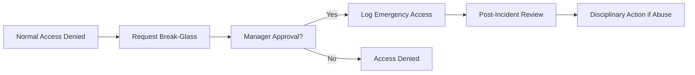
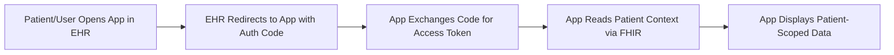
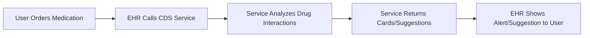
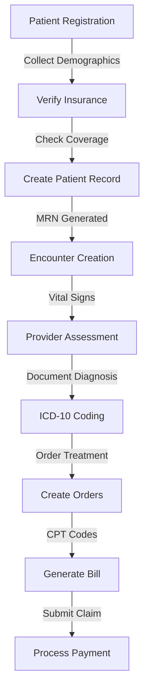
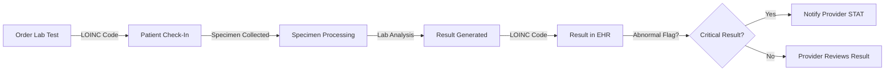
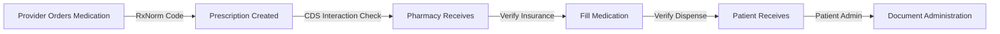

# Healthcare Domain Mode: HIPAA & Clinical Systems (v6)

**Activation**: Score ≥ 15 | **Confidence**: ≥ 50% | **Focus**: HIPAA compliance, PHI handling, clinical data standards, EHR integration

This mode provides specialized documentation patterns for healthcare codebases with emphasis on HIPAA compliance, Protected Health Information (PHI) classification, healthcare data standards (HL7, FHIR), and Electronic Health Record (EHR) integration patterns.

**Scope**: US healthcare systems (HIPAA-regulated), healthcare IT vendors, patient-facing health platforms, clinical decision support systems.

## Table of Contents

1. [HIPAA Compliance Mapping](#hipaa-compliance-mapping)
2. [PHI Classification & Detection](#phi-classification--detection)
3. [Healthcare Data Standards](#healthcare-data-standards)
4. [Security & Access Control](#security--access-control)
5. [EHR Integration Patterns](#ehr-integration-patterns)
6. [Clinical Workflows](#clinical-workflows)
7. [Compliance Checklist](#compliance-checklist)

---

## HIPAA Compliance Mapping

HIPAA defines three categories of safeguards. Map discovered code patterns to these categories.

### Administrative Safeguards

Policies and procedures for access management, security awareness, risk management.

| Requirement | Code Patterns | Documentation Action |
|---|---|---|
| **Security Management Process** | Risk assessment logic, threat modeling, audit trail initialization | Document risk assessment methodology and audit frequency |
| **Designated Security Officer** | Security decision points, policy enforcement, review workflows | Identify who makes security decisions; document approval workflows |
| **Workforce Security** | User provisioning, role assignment, access revocation | Document access control model (RBAC/ABAC); document deprovisioning |
| **Access Management** | Authentication checks, permission validation, ACL patterns | Document auth mechanism (MFA required?); enforce at all layers |
| **Security Awareness Training** | Policy documentation, version control, audit logs | Document training requirements and attestation tracking |

**Code Pattern Example:**
```python
def check_phi_access(user_id, resource_type, action):
    if not user_has_role(user_id, required_role_for(resource_type, action)):
        raise PermissionDenied()
    log_audit_event("PHI_ACCESS", user_id, resource_type, action)
```

---

### Physical Safeguards

Controls for physical access to facilities and devices housing PHI.

| Requirement | Code Patterns | Documentation Action |
|---|---|---|
| **Facility Access Controls** | Server room access logs, surveillance systems | Document physical access controls and monitoring |
| **Workstation Security** | Device lockdown, encryption, USB restrictions | Document workstation hardening requirements |
| **Workstation Use Policy** | Session timeout logic, screen lock triggers | Document timeout thresholds (recommend < 15 min) |
| **Device & Media Controls** | Encryption of media, disposal procedures, inventory tracking | Document media lifecycle (creation → encryption → destruction) |

---

### Technical Safeguards

Access controls, audit controls, integrity controls, transmission security.

| Requirement | Code Patterns | Documentation Action |
|---|---|---|
| **Access Controls** | Password policies, encryption keys, token management | Document auth method, token lifetime, key rotation (≤ 90 days) |
| **Audit Controls** | Logging framework, log retention, log protection | Document what's logged, retention (≥ 6 years), access to logs |
| **Integrity Controls** | Data validation, checksums, digital signatures | Document validation logic and error handling |
| **Transmission Security** | TLS configuration, certificate pinning, API encryption | Document TLS 1.2+ standard, cipher suites, API encryption |

**Code Pattern Example:**
```python
# TLS configuration check
ssl_config:
  protocol_version: "TLSv1.2"  # Minimum
  cipher_suites: ["ECDHE-RSA-AES256-GCM-SHA384"]
  certificate_pinning: true  # For API calls to external systems
  key_exchange: "ECDHE"  # Forward secrecy
```

---

### HIPAA Privacy Rule Mapping

Additional privacy-specific requirements.

| Rule | Code Patterns | Documentation Action |
|---|---|---|
| **Minimum Necessary Standard** | Data access patterns, query limits, field selection | Document how system enforces "need to know" |
| **De-identification (Safe Harbor)** | Data anonymization logic, identifier removal | Document which of 18 identifiers are removed |
| **Patient Rights (Access)** | Data export endpoints, API permission checks | Document patient data access endpoints and response SLAs |
| **Patient Rights (Amendment)** | Update workflows, historical data handling | Document how amendments are tracked vs. overwrites |
| **Patient Rights (Accounting)** | Disclosure logging, recipient tracking | Document what disclosures are tracked and auditable |

---

## PHI Classification & Detection

HIPAA defines 18 categories of identifiers. Detect these in code and flag for documentation.

### The 18 HIPAA Identifiers

| # | Identifier | Database Fields | Regex Pattern | Classification |
|---|---|---|---|---|
| 1 | Names | first_name, last_name, full_name, patient_name | `[A-Z][a-z]+ [A-Z][a-z]+` | HIGH |
| 2 | Geographic < State | city, zip_code, postal_code, address | `^\d{5}(-\d{4})?$` | MEDIUM |
| 3 | Dates (except year) | dob, birth_date, visit_date, admission_date | `\d{1,2}/\d{1,2}/\d{4}` | HIGH |
| 4 | Phone Numbers | phone, telephone, cell_phone, work_phone | `\d{3}[-.]?\d{3}[-.]?\d{4}` | MEDIUM |
| 5 | Fax Numbers | fax, fax_number | `\d{3}[-.]?\d{3}[-.]?\d{4}` | MEDIUM |
| 6 | Email Addresses | email, contact_email, provider_email | `[a-zA-Z0-9._%+-]+@[a-zA-Z0-9.-]+\.[a-z]{2,}` | HIGH |
| 7 | Social Security Numbers | ssn, social_security, tax_id | `\d{3}-\d{2}-\d{4}` | HIGHEST |
| 8 | Medical Record Numbers | mrn, medical_record_id, patient_record_num | Facility-specific | HIGH |
| 9 | Health Plan Beneficiary ID | beneficiary_id, member_id, plan_id | Varies by payer | MEDIUM |
| 10 | Account Numbers | account_id, patient_account, billing_account | Custom format | MEDIUM |
| 11 | Certificate/License Numbers | license_num, provider_license, cert_number | Custom format | MEDIUM |
| 12 | Vehicle Identifiers | vin, vehicle_ident, license_plate | `[A-HJ-NPR-Z0-9]{17}` | LOW |
| 13 | Device Identifiers | serial_number, device_id, imei, device_serial | Manufacturer-specific | MEDIUM |
| 14 | Web URLs | website, url, web_address | `https?://[^\s]+` | LOW |
| 15 | IP Addresses | ip_address, client_ip, remote_ip | `\d{1,3}\.\d{1,3}\.\d{1,3}\.\d{1,3}` | MEDIUM |
| 16 | Biometric Identifiers | fingerprint, iris_scan, voice_print | Custom format | HIGHEST |
| 17 | Full-Face Photos | photo, image, portrait, face_image | Image file w/ face detection | HIGH |
| 18 | Other Unique Identifiers | unique_id, subject_id, research_id | Context-dependent | MEDIUM |

### Detection & Documentation Strategy

**Code Scanning Approach**:
```python
phi_patterns = {
    'ssn': r'\d{3}-\d{2}-\d{4}',
    'dob': r'(19|20)\d{2}-(0[1-9]|1[0-2])-(0[1-9]|[12]\d|3[01])',
    'mrn': r'MRN\d{6,}',
    'email': r'[a-zA-Z0-9._%+-]+@[a-zA-Z0-9.-]+'
}

def flag_unencrypted_phi(model_code):
    if 'self.ssn = ssn' in model_code and 'encrypt' not in model_code:
        return FINDING(severity='CRITICAL',
                      message='Unencrypted PHI field detected')
```

**Documentation for Each PHI Category Found**:
- **Location**: Database tables, API responses, logs
- **Encryption Status**: At-rest and in-transit
- **Access Controls**: Who can view this identifier
- **Retention Policy**: When is it deleted
- **De-identification Status**: Can it be removed without breaking functionality

---

## Healthcare Data Standards

### HL7 v2 (Legacy but Still Common)

**Message Format**:
```
MSH|^~\&|SENDING_APP|SENDING_FACILITY|RECEIVING_APP|RECEIVING_FACILITY|20240115120000||ADT^A01|MSG00001|P|2.5|||||||
PID|1||123456^^^MRN||DOE^JOHN^A||19750615|M|||123 MAIN ST^^ANYTOWN^CA^12345|
```

| Element | Code Patterns | Documentation |
|---|---|---|
| **Message Type** | ADT_A01, ORM_O01, ORU_R01, ADT message handling | Document supported messages and validation |
| **Segment Parsing** | Regex segment parsing, field delimiters `\|`, sub-delimiters `^~\&` | Document how messages are validated |
| **Encoding Characters** | Pipeline, caret, ampersand definitions | Document custom delimiters if non-standard |

**Common Message Types**:
- **ADT**: Admission, Discharge, Transfer
- **ORM**: Order message
- **ORU**: Observation result
- **RGV**: Pharmacy dispense
- **MFN**: Master file notification

---

### HL7 FHIR (RESTful, Modern Standard)

**Pattern Detection**:
```
GET /fhir/Patient/12345 → Resource retrieval
POST /fhir/Patient → Create patient
PUT /fhir/Observation/67890 → Update observation
DELETE /fhir/MedicationRequest/11111 → Delete request
```

| Resource Type | Code Patterns | Documentation |
|---|---|---|
| **Patient** | `/Patient/{id}`, demographics endpoints | Patient identifier strategy, MRN uniqueness |
| **Observation** | `/Observation`, lab/vital results | Result storage, reference ranges, abnormal flags |
| **MedicationRequest** | `/MedicationRequest`, prescriptions | Drug coding (RxNorm), dosage validation |
| **Condition** | `/Condition`, diagnoses | ICD-10 code linkage, severity tracking |
| **Encounter** | `/Encounter`, visits | Visit type classification, provider assignment |

**FHIR Server Documentation**:
- Base URL pattern (`https://fhir.example.com/R4/`)
- Authentication method (OAuth2, API key, mTLS)
- Supported FHIR version (R4 most common)
- Search parameters implemented (`_sort`, `_count`, `_include`)

---

### Clinical Coding Systems

#### ICD-10 (Diagnosis Codes)

**Format**: Letter + 2 digits + decimal + 1-2 alphanumerics (e.g., `E11.9` = Type 2 diabetes without complications)

```python
icd10_pattern = r'^[A-Z]\d{2}(\.\d{1,2})?$'
# Examples: E11, E11.9, E11.21, C80.1

# Documentation should include:
# - Which diagnoses are captured
# - Whether 4-5 digit specificity is required
# - How laterality (left/right) is encoded
```

#### CPT (Procedure Codes)

**Format**: 5-digit numeric (e.g., `99213` = Office visit, established patient)

| Code Range | Specialty |
|---|---|
| 10000–19999 | Surgery (skin, musculoskeletal, respiratory) |
| 70000–79999 | Radiology (X-ray, ultrasound, CT, MRI) |
| 80000–89999 | Pathology (lab and blood banking) |
| 90000–99607 | Evaluation/Management & Medicine (office visits, consultations) |

#### LOINC (Lab Observation Codes)

**Format**: 5-part identifier (e.g., `2345-7` = Glucose [Mass/volume] in Serum or Plasma)

```regex
\d{4,5}-\d{1,2}
```

**Documentation**: Map which lab tests are captured and how LOINC is referenced in result workflows.

#### RxNorm (Drug Codes)

**Format**: Numeric ID assigned by NLM (e.g., `10755` = Lisinopril 10 mg tablet)

#### SNOMED CT (Clinical Terminology)

**Format**: 18-digit numeric (e.g., `195967001` = Asthma)

Used for concepts, disorders, procedures, findings.

#### DICOM (Medical Imaging)

**Tags**: Group-element pairs (e.g., `(0010,0010)` = Patient Name)

| Tag | Meaning | PHI Risk |
|---|---|---|
| (0010,0010) | Patient Name | HIGH |
| (0010,0020) | Patient ID | HIGH |
| (0008,0020) | Study Date | MEDIUM |
| (0028,0010) | Rows (image dimension) | LOW |

**Documentation**: How DICOM files are accessed; whether identifying tags are stripped before archive/sharing.

#### X12 EDI (Insurance Claims)

**Format**: Segment-based (e.g., `ST*837*0019...`)

| Segment | Purpose |
|---|---|
| ST | Transaction set header |
| BHT | Beginning of hierarchical transaction |
| NM1 | Name segment |
| CLM | Claim information |
| SE | End segment |

---

## Security & Access Control

### Audit Logging Requirements

HIPAA requires comprehensive audit logs tracking PHI access.

**What Must Be Logged**:

| Event | Fields to Log | Retention |
|---|---|---|
| User Login | User ID, timestamp, IP, success/failure | 6+ years |
| PHI Access | User ID, resource (MRN/patient), action (read/write/delete), timestamp | 6+ years |
| PHI Modification | Who, what, when, old vs. new value, reason | 6+ years (immutable) |
| Security Event | Event type, severity, response | 6+ years |
| Logout | User ID, session duration, logout method | 6+ years |
| Access Denial | User ID, resource requested, denial reason | 6+ years |
| Admin Action | Admin ID, change type, affected systems | 6+ years |

**Code Pattern Example**:
```python
def log_phi_access(user_id, patient_mrn, action, resource_type):
    """HIPAA audit trail - must not be modified after creation"""
    audit_entry = {
        'timestamp': datetime.utcnow().isoformat(),
        'user_id': user_id,
        'action': action,  # 'READ', 'CREATE', 'UPDATE', 'DELETE'
        'resource_type': resource_type,  # 'Patient', 'Observation', etc.
        'patient_mrn': patient_mrn,
        'source_ip': get_client_ip(),
        'outcome': 'SUCCESS'
    }
    append_immutable_log(audit_entry)  # Cannot be edited
```

---

### Break-the-Glass Procedures

Emergency access to PHI when normal access controls are bypassed.



**Documentation**:
- When break-the-glass is allowed
- Who approves it
- How it's logged (immutable record)
- Post-incident review process

---

### Consent Management

**Code Pattern**:
```python
consent_record = {
    'patient_id': '12345',
    'consent_type': 'TREATMENT_CONSENT',  # or RESEARCH, DISCLOSURE, etc.
    'effective_date': '2024-01-15',
    'expiration_date': '2025-01-14',
    'scope': ['medical_records', 'lab_results'],  # what's covered
    'exceptions': ['pediatric_records'],  # what's excluded
    'revocation_allowed': True,
    'signature_method': 'ELECTRONIC'  # or PAPER
}
```

**Documentation**: How consent is tracked, versioning of consent documents, revocation process.

---

### Access Control Patterns

**Role-Based Access Control (RBAC)**:
```python
role_permissions = {
    'physician': ['create_patient', 'write_observation', 'order_medication'],
    'nurse': ['read_patient', 'write_vitals', 'acknowledge_orders'],
    'billing': ['read_patient', 'read_claims', 'write_claims'],
    'patient': ['read_own_records', 'request_amendment']
}
```

**Attribute-Based Access Control (ABAC)**:
```python
def can_access(user, patient, resource):
    return (
        user.department == patient.assigned_department and
        user.access_level >= resource.required_level and
        user.has_taken_hipaa_training and
        user.active_badge and
        resource.sensitivity_level <= user.clearance_level
    )
```

---

### Encryption Standards

| Data State | Standard | Configuration |
|---|---|---|
| **At Rest** | AES-256 | `encryption_algorithm: 'AES-256-GCM'` |
| **In Transit** | TLS 1.2+ | `ssl_protocol: 'TLSv1.2'`, `cipher_suite: 'ECDHE'` |
| **Key Management** | Separate from data | `encryption_key_location: 'AWS_KMS'` or `HashiCorp_Vault` |

**Documentation**: Key rotation frequency (≤ 90 days), key escrow, backup encryption, encryption of backups.

---

### Data Retention Policy

| Data Type | Minimum Retention | Legal Basis | Disposal Method |
|---|---|---|---|
| Medical Records | 6 years (HIPAA) | HIPAA rule 45 CFR §164 | Secure destruction (shred/incinerate/crypto-shred) |
| Audit Logs | 6 years | HIPAA security rule | Secure archival; no deletion |
| Consent Records | Life of consent + 6 years | Proof of authorization | Secure destruction |
| Breach Records | 6 years | Breach notification rule | Secure archival |
| Billing Records | 10 years | Fraud investigation/appeals | Retain or secure destruction |

---

## EHR Integration Patterns

### Epic (Leading EHR, ~30% market share)

**Common Integrations**:

| Type | Pattern | Documentation |
|---|---|---|
| MyChart API | RESTful, OAuth2 | Scope: `fhir/Patient.read`, `fhir/Observation.read` |
| FHIR R4 Endpoints | `https://epic-fhir.healthcare.org/interconnect-fhir-oauth/api/FHIR/R4/` | Supported resources: Patient, Observation, MedicationRequest, Encounter |
| Interconnect | HL7 v2, direct protocol | Verify provider credentials via Interconnect PKI |
| CDS Hooks | Discovery endpoint + decision endpoint | Hook events: `patient-view`, `order-sign` |

---

### Cerner (Second-largest, ~25% market share)

| Type | Pattern | Documentation |
|---|---|---|
| Millennium | HL7 v2, web services | Document message types (ADT, ORM, ORU) |
| HealtheIntent | FHIR R4, OAuth2 | Similar to Epic; supports Patient, Observation, Condition |
| PowerChart | Custom API, session tokens | For SSO integration |

---

### SMART on FHIR (Standard Launch Pattern)



**Configuration**:
```javascript
const launch_params = {
    'iss': 'https://epic-fhir.healthcare.org/interconnect-fhir-oauth',
    'launch': 'launch_token_xyz',
    'client_id': 'your_app_id',
    'redirect_uri': 'https://yourapp.com/callback',
    'scope': 'launch/patient fhir/Patient.read'
};
```

---

### CDS Hooks (Clinical Decision Support)



**Code Pattern**:
```python
@app.get("/cds-services")
def cds_services():
    return {
        "services": [
            {
                "hook": "medication-prescribe",
                "title": "Drug Interaction Checker",
                "description": "Checks for drug-drug interactions",
                "id": "drug-interaction-check"
            }
        ]
    }

@app.post("/cds-services/drug-interaction-check")
def check_interactions(context):
    interactions = find_interactions(context.medications)
    return {
        "cards": [
            {
                "summary": f"Drug interaction detected: {interaction}",
                "indicator": "warning",
                "suggestions": suggest_alternatives(interaction)
            }
        ]
    }
```

---

## Clinical Workflows

### Patient Registration → Diagnosis → Treatment → Billing



---

### Lab Order → Result → Review



---

### Prescription → Dispensing → Administration



---

## Compliance Checklist

Use this 10-point checklist to verify healthcare documentation completeness:

- [ ] **HIPAA Mapping**: All Security Rule (Admin/Physical/Technical) and Privacy Rule sections identified in code
- [ ] **PHI Inventory**: All 18 HIPAA identifiers cataloged with encryption/access control status
- [ ] **Data Standards**: HL7 v2, FHIR, ICD-10, CPT, LOINC, RxNorm, NDC usage documented
- [ ] **Audit Logging**: What gets logged, retention period (≥ 6 years), access controls, and immutability confirmed
- [ ] **EHR Integrations**: Epic, Cerner, Allscripts, or other vendor integrations documented with BAA status
- [ ] **Break-the-Glass**: Emergency access procedures, approvers, logging, and post-incident review defined
- [ ] **Consent Management**: Consent types, versions, revocation workflow, and tracking mechanism documented
- [ ] **Encryption Standards**: At-rest (AES-256) and in-transit (TLS 1.2+) encryption confirmed; key rotation documented
- [ ] **Workflow Diagrams**: Patient registration, lab orders, prescriptions, insurance verification workflows diagrammed
- [ ] **Data Retention**: Retention policy (minimum 6 years HIPAA, state-specific longer retention) implemented and auditable

---

**References**: HIPAA Security Rule 45 CFR §164.300–.318, HIPAA Privacy Rule 45 CFR §164.500–.534, HL7 FHIR R4 Specification, SMART on FHIR Docs, CDS Hooks Specification
