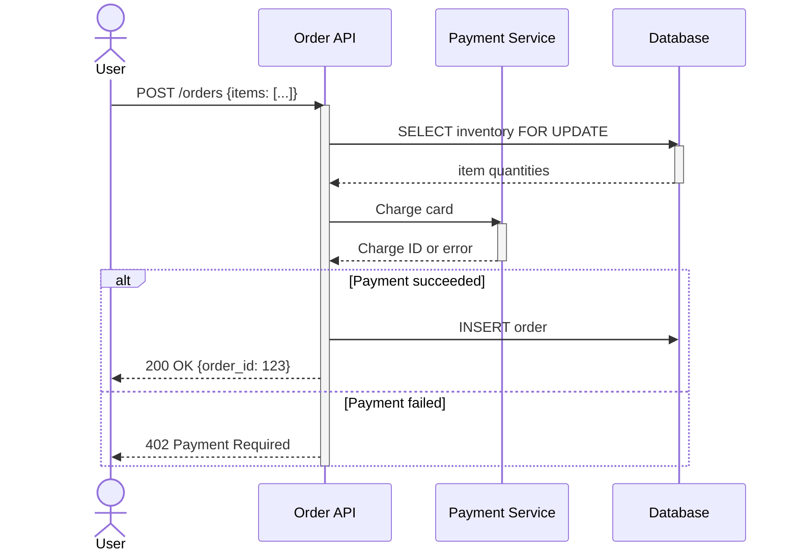
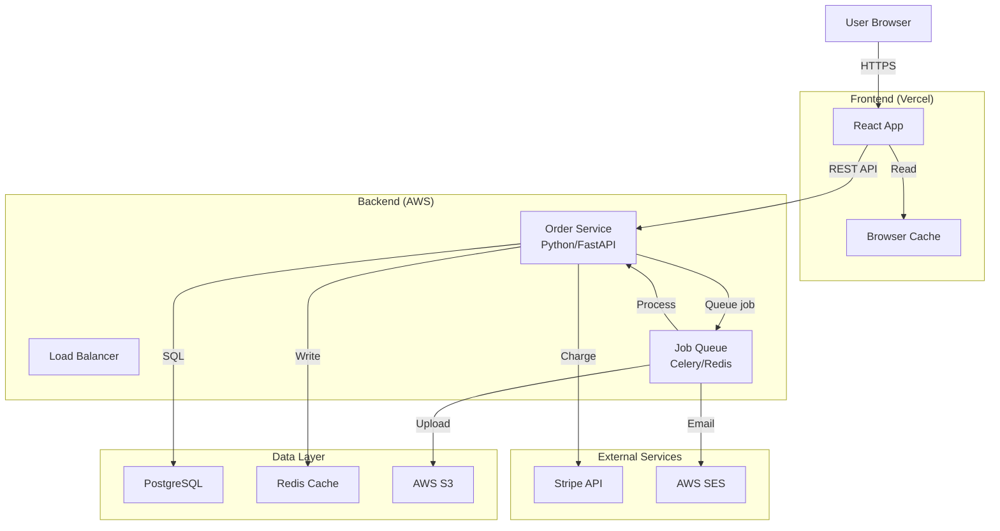
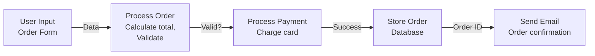
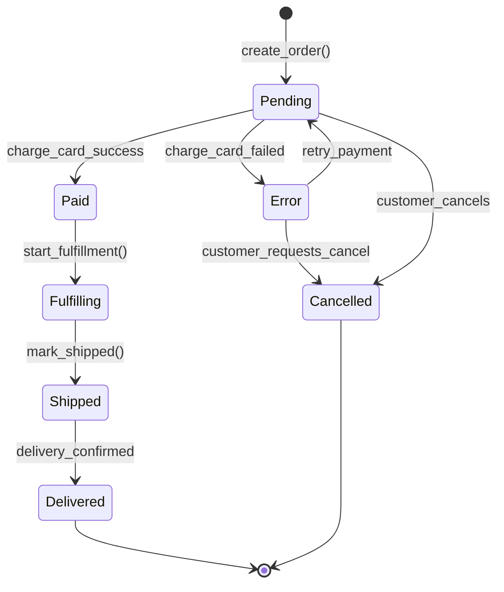
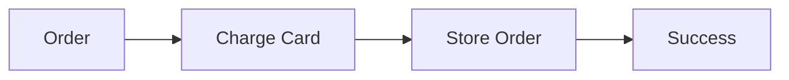
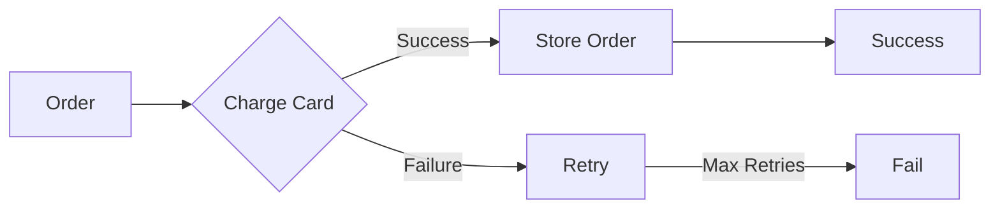

# Visual Documentation Patterns

## Mermaid Diagram Reliability Rules

### Diagram Accuracy Requirements

**Before publishing any diagram:**
1. **Correctness:** Does it match code?
2. **Completeness:** Are important paths included?
3. **Clarity:** Can a new engineer understand it?
4. **Specificity:** Is it accurate or oversimplified?

### Verifying Diagram Accuracy

```bash
# For sequence diagrams: Trace through code path
# 1. Find entry point (function/handler)
# 2. Follow each call
# 3. Verify each arrow in diagram exists in code
# 4. Verify message order matches code execution

# For data flow diagrams: Check data transformations
# 1. Verify each data store exists (database, cache, queue)
# 2. Verify read/write operations match code
# 3. Check timing (are operations sequential or parallel?)
```

### Mermaid Diagram Types

#### 1. Sequence Diagrams (Flow of Control)

**Use for:** How do multiple systems interact?

**Example:**



**Verification checklist:**
- [ ] Every arrow corresponds to code call
- [ ] Message order matches execution order
- [ ] Error paths included
- [ ] Timing assumptions noted (parallel vs serial)

**Common mistakes:**
- Oversimplifying error handling
- Not showing database locks
- Missing async operations
- Wrong message order

#### 2. Architecture Diagrams (System Boundaries)

**Use for:** What are the major components?



**Verification checklist:**
- [ ] All services drawn
- [ ] Public APIs shown (→ arrows)
- [ ] Data flows clear
- [ ] External dependencies marked

#### 3. Data Flow Diagrams (How Data Moves)

**Use for:** Where does data go?



**Verification checklist:**
- [ ] Data transformations shown
- [ ] Failure paths included
- [ ] Data stores identified
- [ ] External APIs marked

#### 4. State Diagrams (Entity State Transitions)

**Use for:** What states can an entity be in?



**Verification checklist:**
- [ ] All possible states included
- [ ] All valid transitions drawn
- [ ] Invalid transitions NOT drawn
- [ ] Entry/exit points clear

---

## ASCII Fallback for Environments Without Mermaid

### When to Use ASCII Fallbacks

- Documentation in text files
- Terminal output
- Systems that don't support Markdown
- Offline documentation

### ASCII Diagram Patterns

**Simple sequence:**
```
User
  |
  |-- POST /orders
  |
  v
Order API
  |
  |-- Query inventory (DB)
  |
  v
Payment Service
  |
  |-- Charge card
  |
  v
Order API
  |
  |-- Store order (DB)
  |
  v
User (200 OK)
```

**System architecture:**
```
┌─────────────┐
│   Browser   │
└──────┬──────┘
       │
       │ HTTPS
       v
┌─────────────────┐
│  Order API      │  Python/FastAPI
│  Load Balancer  │  on AWS
└──────┬──────────┘
       │
   ┌───┴────┬────────┐
   v        v        v
┌──────┐┌────────┐┌──────────┐
│  PG  ││ Redis  ││ S3       │
│  DB  ││ Cache  ││ Uploads  │
└──────┘└────────┘└──────────┘
```

**State machine:**
```
        ┌─────────────┐
        │   Pending   │
        └──────┬──────┘
               │
    ┌──────────┴──────────┐
    │                     │
    v                     v
┌────────┐          ┌──────────┐
│  Paid  │          │ Cancelled│
└───┬────┘          └──────────┘
    │
    v
┌──────────┐
│Fulfilling│
└───┬──────┘
    │
    v
┌─────────┐
│ Shipped │
└───┬─────┘
    │
    v
┌───────────┐
│ Delivered │
└───────────┘
```

### ASCII Conversion Tool

```python
def ascii_box(title, width=20):
    """Generate ASCII box for diagrams"""
    top = "┌" + "─" * (width - 2) + "┐"
    middle = f"│ {title:<{width-4}} │"
    bottom = "└" + "─" * (width - 2) + "┘"
    return f"{top}\n{middle}\n{bottom}"

# Usage
print(ascii_box("Order API"))
# Output:
# ┌──────────────────┐
# │ Order API        │
# └──────────────────┘
```

---

## Architecture Diagrams Specifically

### Levels of Abstraction

**Level 1: System Context**
```
What systems are involved?
- External systems
- Entry points
- Data stores
```

**Level 2: Container**
```
What applications/services?
- Microservices
- Monolith components
- External APIs
```

**Level 3: Component**
```
What modules inside service?
- Controllers
- Services
- Repositories
```

**Level 4: Code**
```
Classes, functions, code structure
```

### C4 Model for Architecture

```
Level 1: System Context
┌─────────────────────────────────────────┐
│          Internet User                  │
│         (Customer)                      │
└──────────────┬──────────────────────────┘
               │
               │ Uses
               v
┌─────────────────────────────────────────┐
│      E-Commerce System                  │
│ ┌───────────────────────────────────┐   │
│ │ Web App                          │   │
│ │ Order Service                    │   │
│ │ Database                         │   │
│ └───────────────────────────────────┘   │
└──────────┬──────────────┬────────────────┘
           │              │
           │ Uses         │ Integrates
           v              v
      ┌──────────┐   ┌──────────┐
      │Stripe    │   │Email     │
      │Payments  │   │Service   │
      └──────────┘   └──────────┘
```

```
Level 2: Containers
┌──────────────────────────────────────────────┐
│          Web Application                      │
│  (Browser-based SPA)                         │
└────────────┬─────────────────────────────────┘
             │
             │ REST API
             │ JSON/HTTPS
             v
┌──────────────────────────────────────────────┐
│     Backend Application                       │
│  (Python, FastAPI)                           │
│ ┌────────────┐ ┌────────┐ ┌──────────────┐  │
│ │API Layer   │ │Business│ │Job Queue    │  │
│ │            │ │Logic   │ │(Celery)     │  │
│ └────────────┘ └────────┘ └──────────────┘  │
└──────────┬──────────┬──────────────┬─────────┘
           │          │              │
           v          v              v
    ┌────────┐ ┌────────────┐ ┌──────────┐
    │PostgreSQL│ │Redis Cache │ │AWS SQS  │
    └────────┘ └────────────┘ └──────────┘
```

---

## Sequence Diagrams for Critical Flows

### Order Creation Sequence

```mermaid
sequenceDiagram
    actor Customer
    participant Frontend
    participant API
    participant Inventory
    participant Payment
    participant DB
    participant Email

    Customer->>Frontend: Fill order form
    Frontend->>API: POST /orders
    activate API

    API->>Inventory: Check stock
    activate Inventory
    Inventory->>DB: SELECT items FOR UPDATE
    activate DB
    DB-->>Inventory: quantities
    deactivate DB

    alt Stock available
        Inventory-->>API: OK
    else Out of stock
        Inventory-->>API: OutOfStockError
        API-->>Frontend: 400 error
        deactivate API
        deactivate Inventory
    end
    deactivate Inventory

    API->>Payment: Charge card
    activate Payment
    Payment-->>API: Charge ID
    deactivate Payment

    API->>DB: INSERT order
    API->>DB: UPDATE inventory
    activate DB
    DB-->>API: Success
    deactivate DB

    API->>Email: Queue confirmation email
    API-->>Frontend: 201 {order_id, total}
    deactivate API

    Frontend-->>Customer: Show confirmation

    Email->>Email: Send async
```

**Verification:**
- [ ] Matches actual code flow
- [ ] Error paths included
- [ ] Timing assumptions noted
- [ ] External service calls shown

---

## Avoiding Common Diagram Mistakes

### Mistake 1: Oversimplified Error Handling

**WRONG:**


**RIGHT:**


### Mistake 2: Missing Async Operations

**WRONG (implies synchronous):**
```
API → Payment Service → Email
```

**RIGHT (shows async):**
```
API → Payment Service
API → Job Queue → Email (async)
```

### Mistake 3: Unclear Data Transformations

**WRONG:**
```
Input → Process → Output
```

**RIGHT:**
```
Raw User Input
    ↓
Validate (reject if invalid)
    ↓
Normalize (clean data)
    ↓
Transform (format for DB)
    ↓
Persist
```

### Mistake 4: Mixing Abstraction Levels

**WRONG (mixes C4 levels):**
```
Browser → HTTP → Django → Function → SQL Query
```

**RIGHT (consistent level):**
```
Frontend → REST API → Backend → Database
```

---

## Diagram Maintenance

### Update Checklist

When code changes:
- [ ] Does it affect any sequence diagrams? Update flows
- [ ] Does it add/remove services? Update architecture diagram
- [ ] Do state transitions change? Update state machines
- [ ] Does data flow change? Update data flow diagrams

### Versioning Diagrams

```markdown
## Order Processing Sequence (v2.1)

**Last updated:** 2026-03-12
**Changes from v2.0:**
- Added payment retry loop
- Separated inventory check into separate service call

**Diagram:**
[mermaid diagram here]

**Verified against:**
- Code: src/orders/api.py:45-120
- Tests: test_order_creation_flow
```

---

## Summary: Diagram Quality Checklist

- [ ] Diagram matches current code
- [ ] All major flows shown
- [ ] Error handling included
- [ ] External dependencies marked
- [ ] Timing/async operations clear
- [ ] Abstraction level consistent
- [ ] New engineers can understand it
- [ ] Can be verified against code
- [ ] Kept up to date (versioned)
- [ ] Appropriate diagram type for use case
