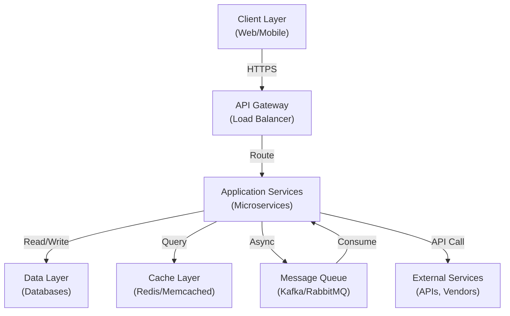
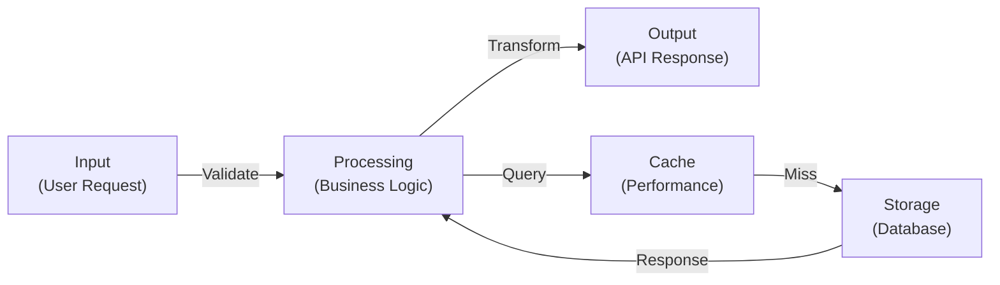
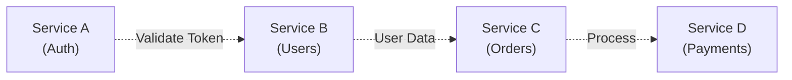

# Architecture Documentation Template

**Project**: {{PROJECT_NAME}} | **Version**: {{VERSION}} | **Last Updated**: {{DATE}}

---

## Executive Summary

{{2-3 sentence overview of the system's purpose, scope, and key technology choices}}

**Key Metrics**:
- Users/Throughput: {{METRIC}}
- Core Services: {{NUMBER}}
- Database Tier: {{TYPE}}
- Primary Languages: {{LANGUAGES}}

---

## System Context Diagram



---

## Component Overview

| Component | Responsibility | Technology | Owner | Status |
|---|---|---|---|---|
| {{NAME}} | {{RESPONSIBILITY}} | {{TECH_STACK}} | {{TEAM}} | {{STATUS}} |
| {{NAME}} | {{RESPONSIBILITY}} | {{TECH_STACK}} | {{TEAM}} | {{STATUS}} |

---

## Data Flow Diagram



**Key Data Flows**:
1. {{FLOW_NAME}}: {{FLOW_DESCRIPTION}}
2. {{FLOW_NAME}}: {{FLOW_DESCRIPTION}}

---

## Design Decisions & Trade-offs

### Decision 1: {{DECISION_TITLE}}

**Context**: {{Context of the decision—what problem needed solving?}}

**Options Considered**:
1. {{Option A}} — Pros: {{pros}}, Cons: {{cons}}
2. {{Option B}} — Pros: {{pros}}, Cons: {{cons}}
3. {{Option C}} — Pros: {{pros}}, Cons: {{cons}}

**Decision**: Chose {{Option}} because {{rationale}}

**Trade-offs**:
- ✓ Benefit 1
- ✗ Cost 1 (mitigation: {{mitigation}})

---

### Decision 2: {{DECISION_TITLE}}

**Context**: {{Context}}

**Decision**: {{Decision and rationale}}

**Trade-offs**:
- ✓ Benefit 1
- ✗ Cost 1

---

## Contrarian Review

**Question**: What could go wrong with these design choices?

- {{Potential issue 1}}: {{How likely? What mitigation exists?}}
- {{Potential issue 2}}: {{How likely? What mitigation exists?}}
- {{Potential issue 3}}: {{How likely? What mitigation exists?}}

**Risks to Monitor**:
1. {{Risk}}: Likelihood {{HIGH/MEDIUM/LOW}}, Impact {{HIGH/MEDIUM/LOW}}
2. {{Risk}}: Likelihood {{HIGH/MEDIUM/LOW}}, Impact {{HIGH/MEDIUM/LOW}}

---

## Scaling & Performance

### Throughput Targets

| Scenario | QPS | Latency (P99) | Storage Growth |
|---|---|---|---|
| Current | {{QPS}} | {{LATENCY}} | {{STORAGE}} |
| 3-month forecast | {{QPS}} | {{LATENCY}} | {{STORAGE}} |
| 1-year forecast | {{QPS}} | {{LATENCY}} | {{STORAGE}} |

### Bottleneck Analysis

**Current bottlenecks** (from profiling):
1. {{Bottleneck 1}}: {{Root cause}}, mitigation: {{Solution}}
2. {{Bottleneck 2}}: {{Root cause}}, mitigation: {{Solution}}

**Scaling strategy**:
- Horizontal: {{How to scale out?}}
- Vertical: {{When to scale up?}}
- Caching: {{What gets cached?}}
- Sharding: {{Sharding strategy if applicable}}

---

## Security Architecture

### Authentication & Authorization

- **Auth Mechanism**: {{OAuth2 / SAML / API Key / etc.}}
- **Identity Provider**: {{IdP name}}
- **Token Lifetime**: {{Duration}}
- **MFA**: {{Required / Optional / Not implemented}}

### Data Protection

- **Encryption at Rest**: {{Algorithm, e.g., AES-256-GCM}}
- **Encryption in Transit**: {{TLS version, e.g., TLS 1.3}}
- **Key Management**: {{Key vault location, rotation frequency}}

### Compliance

- **Standards**: {{GDPR / HIPAA / SOC2 / PCI-DSS / etc.}}
- **Audit Trails**: {{What gets logged?}}
- **Data Retention**: {{Policy}}

---

## Deployment Architecture

### Environments

| Environment | Region | Replicas | Backup | Recovery |
|---|---|---|---|---|
| Production | {{REGION}} | {{COUNT}} | {{ENABLED}} | RTO: {{RTO}}, RPO: {{RPO}} |
| Staging | {{REGION}} | {{COUNT}} | {{ENABLED}} | RTO: {{RTO}}, RPO: {{RPO}} |
| Development | {{REGION}} | {{COUNT}} | {{ENABLED}} | RTO: {{RTO}}, RPO: {{RPO}} |

### Disaster Recovery

- **RTO Target**: {{Time}}
- **RPO Target**: {{Time}}
- **Recovery Plan**: {{1. Step, 2. Step, 3. Step}}
- **Last Tested**: {{Date}}

---

## Technology Stack

| Layer | Technology | Version | Notes |
|---|---|---|---|
| **Language** | {{LANGUAGE}} | {{VERSION}} | {{Notes}} |
| **Framework** | {{FRAMEWORK}} | {{VERSION}} | {{Notes}} |
| **Database** | {{DB}} | {{VERSION}} | {{Notes}} |
| **Cache** | {{CACHE}} | {{VERSION}} | {{Notes}} |
| **Queue** | {{QUEUE}} | {{VERSION}} | {{Notes}} |
| **Container** | {{CONTAINER}} | {{VERSION}} | {{Notes}} |
| **Orchestration** | {{ORCHESTRATOR}} | {{VERSION}} | {{Notes}} |
| **Monitoring** | {{MONITORING}} | {{VERSION}} | {{Notes}} |

---

## Known Limitations & Future Improvements

### Current Limitations

1. **Limitation**: {{Specific limitation}}
   - **Impact**: {{What does this affect?}}
   - **Workaround**: {{How to work around it?}}
   - **Timeline to Fix**: {{Estimated or {{Backlog}}}

2. **Limitation**: {{Specific limitation}}
   - **Impact**: {{What does this affect?}}
   - **Workaround**: {{How to work around it?}}
   - **Timeline to Fix**: {{Estimated or {{Backlog}}}

### Planned Improvements

- [ ] {{Improvement 1}} — Expected impact: {{Impact}}, Timeline: {{Timeline}}
- [ ] {{Improvement 2}} — Expected impact: {{Impact}}, Timeline: {{Timeline}}

---

## Appendix: Architecture Diagrams

### Database Schema (High Level)

```
{{Include simplified ER diagram or list of major tables}}

Tables:
- users (PK: id, email, created_at)
- orders (PK: id, FK: user_id, status, created_at)
- items (PK: id, FK: order_id, price, quantity)
```

### Service Dependencies



### Network Architecture

```
[Internet] →
  [CDN/CloudFlare] →
    [API Gateway + WAF] →
      [Load Balancer] →
        [Service Pods 1..N] →
          [Database Primary] + [Replica 1] + [Replica 2]
```

---

## References

- **Internal Docs**: {{Link to internal wiki}}
- **Design Document**: {{Link to RFC or ADR}}
- **Incident Reports**: {{Link to postmortems}}
- **Monitoring Dashboard**: {{Link to Grafana/Datadog}}

---

**Questions?** Open an issue or reach out to {{TEAM_SLACK}} on Slack.
