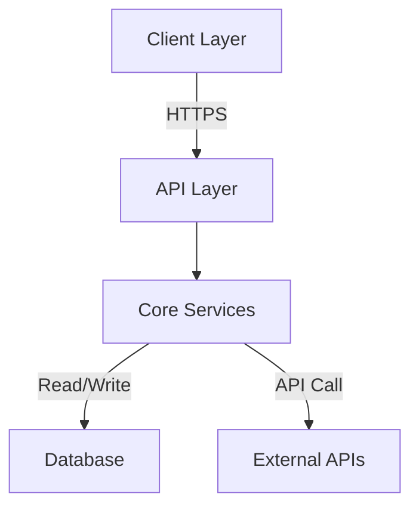

# Codebase Handoff Package

**Project**: {{PROJECT_NAME}} | **Date**: {{DATE}} | **From**: {{DEPARTING_TEAM}} | **To**: {{RECEIVING_TEAM}}

---

## Executive Summary

{{2-3 paragraph summary of what this codebase does, its business impact, and key technologies}}

### Handoff Readiness Score

```
Overall Readiness: {{SCORE}}/10

✓ Documentation:     {{SCORE}}/10
✓ Test Coverage:     {{SCORE}}/10
✓ Infrastructure:    {{SCORE}}/10
✓ Runbook:           {{SCORE}}/10
✓ Knowledge Transfer: {{SCORE}}/10
```

**Status**: {{READY | NEEDS_WORK | NOT_READY}} for handoff

**Critical Gaps** (if any):
- {{Gap 1}}: Recommendation: {{Action}}
- {{Gap 2}}: Recommendation: {{Action}}

---

## Quick Start

### Prerequisites

- {{Requirement 1}}, version {{VERSION}}
- {{Requirement 2}}, version {{VERSION}}
- {{Requirement 3}}
- Access to: {{Service/Resource}}

### Setup (5 minutes)

```bash
# Clone repository
git clone {{REPO_URL}}
cd {{PROJECT_NAME}}

# Install dependencies
{{INSTALL_COMMAND}}

# Configure environment
cp .env.example .env
# Edit .env with your {{SERVICE}} credentials

# Start local development
{{START_COMMAND}}

# Run tests to verify setup
{{TEST_COMMAND}}
```

**Expected Output**:
```
✓ Server running on http://localhost:{{PORT}}
✓ Connected to database
✓ All tests passed
```

**Troubleshooting**: See [Setup Troubleshooting](#setup-troubleshooting)

---

## Project Structure

```
{{PROJECT_NAME}}/
├── src/                    # Source code
│   ├── api/               # API routes
│   ├── models/            # Data models
│   ├── services/          # Business logic
│   └── utils/             # Utilities
├── tests/                 # Test suites
├── docs/                  # Documentation
├── config/                # Configuration files
├── docker/                # Docker files
├── scripts/               # Utility scripts
├── .env.example           # Environment template
├── package.json           # Dependencies
└── README.md              # Project README
```

**Key Files**:
- `{{FILE}}` — {{Description and why it matters}}
- `{{FILE}}` — {{Description and why it matters}}

---

## System Architecture Overview

**High-Level Diagram**:



**Key Components**:
1. **{{Component}}** — {{Responsibility}}, Owner: {{Team}}
2. **{{Component}}** — {{Responsibility}}, Owner: {{Team}}
3. **{{Component}}** — {{Responsibility}}, Owner: {{Team}}

**Technology Stack**:
- Language: {{LANGUAGE}}
- Framework: {{FRAMEWORK}}
- Database: {{DATABASE}}
- Cache: {{CACHE}}
- Infrastructure: {{INFRASTRUCTURE}}

See [Architecture Documentation](./04-architecture.md) for detailed diagrams and design decisions.

---

## Deployment & Operations

### Environments

| Env | Region | URL | Replicas | Backup |
|---|---|---|---|---|
| Production | {{REGION}} | {{URL}} | {{COUNT}} | Daily |
| Staging | {{REGION}} | {{URL}} | {{COUNT}} | Weekly |
| Development | {{REGION}} | {{URL}} | {{COUNT}} | N/A |

### Deployment Process

**Manual Deploy** (rarely needed):
```bash
# Deploy to staging
git push origin feature/my-feature
# Create pull request
# Get approval and merge to main

# Staging deploys automatically on merge to main
# Production requires manual promotion

# Promote to production
git tag v{{VERSION}}
git push origin v{{VERSION}}
# Production deployment starts automatically
```

**Automated CI/CD**:
- GitHub Actions triggers on commits to `main`
- Staging deploys automatically
- Production requires tag-based promotion
- Rollback: Redeploy previous tag

**Monitoring During Deploy**:
```bash
# Watch logs in real-time
kubectl logs -f deployment/{{PROJECT}} -n {{NAMESPACE}}

# Check deployment status
kubectl rollout status deployment/{{PROJECT}} -n {{NAMESPACE}}

# Check application health
curl https://{{URL}}/health
```

**Rollback Procedure** (if needed):
```bash
# Identify previous stable version
git tag -l | sort -V | tail -5

# Rollback to previous version
git tag v{{PREVIOUS_VERSION}}
git push origin v{{PREVIOUS_VERSION}}

# Verify rollback completed
kubectl rollout status deployment/{{PROJECT}} -n {{NAMESPACE}}
```

See [Runbook](#runbook) for common issues and troubleshooting.

---

## Key Features & Business Logic

### Feature 1: {{Feature Name}}

**What It Does**: {{2-3 sentence description}}

**Code Location**: `src/{{path}}/{{file}}.{{ext}}`

**How It Works**:
```
1. User initiates {{action}}
2. System {{step 2}}
3. {{Database operation}}
4. {{Result}}
```

**Gotchas**:
- {{Gotcha 1}}: {{Explanation}}
- {{Gotcha 2}}: {{Explanation}}

---

### Feature 2: {{Feature Name}}

**What It Does**: {{Description}}

**Code Location**: `src/{{path}}/{{file}}.{{ext}}`

**How It Works**: {{Steps}}

**Gotchas**: {{Issues to watch for}}

---

## Known Issues & Workarounds

| Issue | Severity | Workaround | Timeline |
|---|---|---|---|
| {{Issue}} | {{HIGH/MEDIUM/LOW}} | {{Workaround}} | Fixed in {{VERSION}} |
| {{Issue}} | {{HIGH/MEDIUM/LOW}} | {{Workaround}} | {{Backlog}} |

---

## Compliance & Security

### Standards & Certifications

- **{{Standard}}**: Status: {{COMPLIANT/IN_PROGRESS/NOT_APPLICABLE}}
- **{{Standard}}**: Status: {{COMPLIANT/IN_PROGRESS/NOT_APPLICABLE}}

### Data Protection

- **Encryption at Rest**: {{Algorithm}}, keys in {{Location}}
- **Encryption in Transit**: {{TLS version}}, HTTPS enforced
- **PII Handling**: {{Policy}}
- **Data Retention**: {{Policy}}

### Audit Logging

- **Audit Logs**: {{What's logged?}}
- **Retention**: {{Duration}}
- **Access**: {{Who can review logs?}}

**Check Audit Logs**:
```bash
# View recent audit events
{{COMMAND_TO_VIEW_LOGS}}
```

See [Compliance Documentation](./13-compliance.md) for full details.

---

## Testing Strategy

### Test Coverage

- **Unit Tests**: {{COVERAGE}}%
- **Integration Tests**: {{COVERAGE}}%
- **End-to-End Tests**: {{COVERAGE}}%
- **Overall**: {{OVERALL}}%

### Running Tests

```bash
# All tests
npm test

# Unit tests only
npm run test:unit

# Integration tests
npm run test:integration

# E2E tests (requires staging environment)
npm run test:e2e

# With coverage report
npm run test:coverage
```

**Coverage Report**:
```bash
open coverage/index.html
```

### Adding New Tests

**Pattern**: Place tests next to source files with `{{TEST_NAMING_CONVENTION}}`

**Example**:
```javascript
// src/services/user.test.js
describe('UserService', () => {
  it('should create a new user', () => {
    // Arrange
    const userData = { name: 'John' };
    // Act
    const user = createUser(userData);
    // Assert
    expect(user.id).toBeDefined();
  });
});
```

---

## Runbook

### Common Scenarios

#### Scenario 1: Service Won't Start

**Symptoms**: `Error: ECONNREFUSED` or timeout

**Resolution**:
1. Check dependencies: `{{CHECK_COMMAND}}`
2. Verify database connection: `{{VERIFY_COMMAND}}`
3. Check logs: `{{LOG_COMMAND}}`
4. If unresolved, contact: {{SLACK_CHANNEL}}

#### Scenario 2: High Memory Usage

**Symptoms**: Pod OOMKilled, slow responses

**Investigation**:
```bash
# Check memory usage
kubectl top pod {{POD_NAME}} -n {{NAMESPACE}}

# Check heap dump (Node.js)
node --inspect {{APP_FILE}}
```

**Solutions**:
- Increase memory limits in `{{CONFIG_FILE}}`
- Check for memory leaks in logs
- Consider database query optimization

#### Scenario 3: Database Connection Issues

**Symptoms**: `Connection timeout`, `Connection refused`

**Check**:
```bash
# Verify database is accessible
{{CONNECTIVITY_CHECK}}

# Check connection pool status
{{POOL_STATUS_COMMAND}}

# View recent database errors
{{DB_ERROR_LOG}}
```

**Solutions**:
- Restart database connection pool: `{{RESTART_POOL_COMMAND}}`
- Check database credentials in `.env`
- Verify network/firewall rules

---

### On-Call Procedures

**When to Page On-Call Engineer**:
- {{Condition 1}}
- {{Condition 2}}
- {{Condition 3}}

**On-Call Contact**:
- Primary: {{NAME}} ({{SLACK}})
- Secondary: {{NAME}} ({{SLACK}})

**Escalation Path**:
1. Page on-call engineer
2. If no response in {{TIMEOUT}}, page team lead
3. If no response, escalate to {{MANAGER}}

---

## Dependency & External Integrations

### Required Services

| Service | Purpose | Status | Owner | SLA |
|---|---|---|---|---|
| {{Service}} | {{Purpose}} | {{Healthy/Degraded}} | {{Team}} | {{SLA}} |
| {{Service}} | {{Purpose}} | {{Healthy/Degraded}} | {{Team}} | {{SLA}} |

### Third-Party APIs

| API | Purpose | Key Location | Rate Limit | Cost |
|---|---|---|---|---|
| {{API}} | {{Purpose}} | `.env: API_KEY` | {{Limit}} | {{Cost}} |
| {{API}} | {{Purpose}} | `.env: API_KEY` | {{Limit}} | {{Cost}} |

**Monitoring Integrations**:
```bash
# Check all external API health
{{HEALTH_CHECK_COMMAND}}
```

---

## Handoff Questions for Original Team

{{HIGH PRIORITY}}
1. **{{Question}}** — {{Context}}
2. **{{Question}}** — {{Context}}

{{MEDIUM PRIORITY}}
3. **{{Question}}** — {{Context}}
4. **{{Question}}** — {{Context}}

{{LOW PRIORITY}}
5. **{{Question}}** — {{Context}}

---

## First Week Checklist

**Week 1 Goals**: Get comfortable with codebase and deploy first change

- [ ] **Day 1-2**: Setup environment (5 min), run tests (10 min), explore codebase (2 hours)
- [ ] **Day 2-3**: Read architecture docs, understand main data flows
- [ ] **Day 3-4**: Make first code change (small fix or refactor), submit PR
- [ ] **Day 4-5**: Deploy change to staging, verify in production
- [ ] **Day 5**: Attend knowledge transfer session with {{DEPARTING_TEAM}}

**Success Criteria**:
- [ ] Local environment runs without errors
- [ ] All tests pass
- [ ] Successfully deployed a change to staging
- [ ] Understand the 3 main features of the system
- [ ] Can troubleshoot common issues

---

## Setup Troubleshooting

### Docker Issues

**Error**: `Cannot connect to Docker daemon`

**Solution**:
```bash
# Start Docker
docker daemon

# Or on Mac:
open /Applications/Docker.app
```

---

### Database Connection Issues

**Error**: `ECONNREFUSED: connect EADDRNOTAVAIL`

**Solution**:
```bash
# Ensure database is running
{{DB_START_COMMAND}}

# Verify connection settings in .env
cat .env | grep DB_

# Test connection
{{CONNECTION_TEST_COMMAND}}
```

---

### Port Already in Use

**Error**: `EADDRINUSE: address already in use :::3000`

**Solution**:
```bash
# Find process using port
lsof -i :3000

# Kill process (if not needed)
kill -9 {{PID}}

# Or use different port
PORT=3001 npm start
```

---

## Documentation Index

| Document | Purpose | Location |
|---|---|---|
| Architecture | System design, diagrams, decisions | [04-architecture.md](./04-architecture.md) |
| API Reference | Endpoint documentation, examples | [05-api-reference.md](./05-api-reference.md) |
| Module Documentation | Individual module details | [06-module-docs/](./06-module-docs/) |
| Compliance | Standards, audit trails, security | [13-compliance/](./13-compliance/) |
| FAQ | Common questions and answers | [FAQ.md](./FAQ.md) |
| Troubleshooting | Common issues and solutions | [Troubleshooting.md](./Troubleshooting.md) |

---

## Contact & Support

**Questions About the Codebase**:
- Slack: {{SLACK_CHANNEL}}
- Email: {{TEAM_EMAIL}}

**Incident Response**:
- Page: {{PAGERDUTY_URL}} or call {{PHONE}}
- Status: {{STATUS_PAGE_URL}}

**Departing Team Contact** (knowledge transfer):
- {{PERSON_NAME}}: {{EMAIL}} | {{SLACK}}
- {{PERSON_NAME}}: {{EMAIL}} | {{SLACK}}

---

## Version History

| Version | Date | Changes | Reviewer |
|---|---|---|---|
| 1.0 | {{DATE}} | Initial handoff package | {{NAME}} |

---

**Handoff Date**: {{DATE}} | **Prepared By**: {{NAME}} | **Reviewed By**: {{NAME}}
