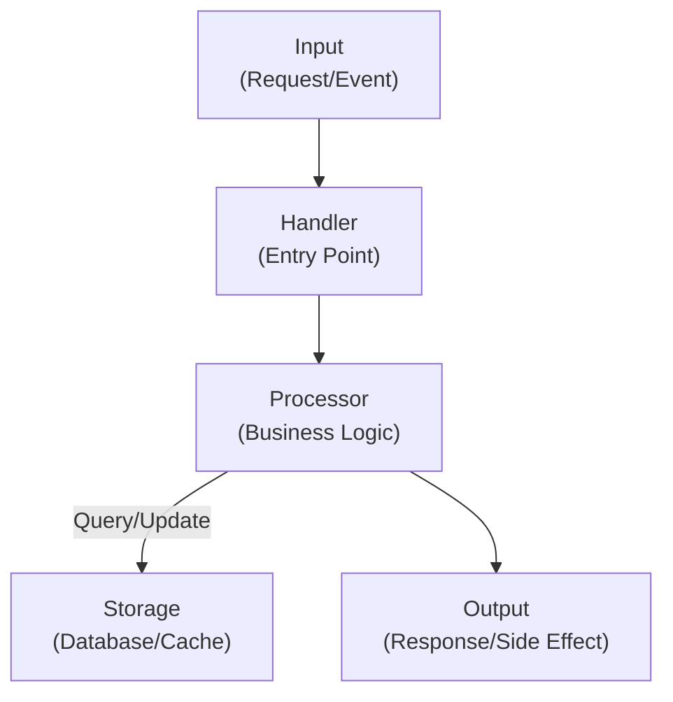

# Module Documentation Template

**Module Name**: {{MODULE_NAME}} | **Version**: {{VERSION}} | **Last Updated**: {{DATE}}

---

## Purpose & Overview

{{2-3 paragraph description of what this module does, why it exists, and its role in the larger system}}

**Module Type**: {{CORE | UTILITY | MIDDLEWARE | INTEGRATION | EXPERIMENTAL}}

**Maintainer**: {{TEAM_NAME}} | **On-Call**: {{SLACK_CHANNEL}}

---

## Quick Reference

| Aspect | Value |
|--------|-------|
| **Language** | {{LANGUAGE}} |
| **Test Coverage** | {{COVERAGE}}% |
| **Dependencies** | {{NUMBER}} |
| **External APIs** | {{NUMBER}} |
| **Performance SLA** | {{SLA}} (P99) |
| **Last Incident** | {{DATE}} — {{Brief description}} |

---

## Core Responsibilities

1. **Responsibility 1**: {{Description of what the module does}}
2. **Responsibility 2**: {{Description of what the module does}}
3. **Responsibility 3**: {{Description of what the module does}}

---

## Architecture

### Component Diagram



### Data Flow

**Typical Flow**:
```
User Request
    ↓
{{Module}} Handler validates input
    ↓
{{Module}} Service processes business logic
    ↓
Database operation (if needed)
    ↓
Response to caller
```

---

## Key Functions/Classes

### Function/Class 1: `{{NAME}}`

**Type**: {{Function | Class | Interface}}

**Purpose**: {{Description of what it does}}

**Signature**:
```javascript
{{LANGUAGE_SPECIFIC_SIGNATURE}}
// Returns: {{Return type and description}}
```

**Parameters**:
| Name | Type | Required | Default | Description |
|------|------|----------|---------|-------------|
| `{{param}}` | {{type}} | Yes/No | {{default}} | {{Description}} |

**Returns**:
- **Type**: {{Type}}
- **Description**: {{What is returned?}}

**Throws**:
- `{{ErrorType}}` — {{When/why this error is thrown}}

**Example**:
```javascript
// Basic usage
const result = {{NAME}}({{args}});

// With error handling
try {
  const result = await {{NAME}}({{args}});
  console.log('Success:', result);
} catch (error) {
  console.error('Failed:', error.message);
}
```

**Performance Note**: {{Complexity, optimization tips, or performance characteristics}}

---

### Function/Class 2: `{{NAME}}`

**Type**: {{Function | Class | Interface}}

**Purpose**: {{Description}}

**Signature**:
```javascript
{{SIGNATURE}}
```

**Example**:
```javascript
{{CODE_EXAMPLE}}
```

---

## Dependencies

### Internal Dependencies

| Module | Purpose | Usage | Notes |
|--------|---------|-------|-------|
| `{{module}}` | {{Purpose}} | `import { func } from '{{module}}'` | {{Notes}} |
| `{{module}}` | {{Purpose}} | `import { func } from '{{module}}'` | {{Notes}} |

### External Dependencies

| Package | Version | Purpose | Status |
|---------|---------|---------|--------|
| `{{package}}` | `{{version}}` | {{Purpose}} | {{Current/Outdated}} |
| `{{package}}` | `{{version}}` | {{Purpose}} | {{Current/Outdated}} |

**Breaking Changes**:
- `{{package}}`: {{Description of breaking change}}

---

## Configuration

### Environment Variables

| Variable | Type | Required | Default | Description |
|----------|------|----------|---------|-------------|
| `{{VAR}}` | {{type}} | Yes/No | {{default}} | {{Description}} |
| `{{VAR}}` | {{type}} | Yes/No | {{default}} | {{Description}} |

**Example `.env`**:
```bash
{{EXAMPLE_ENV}}=value
```

### Configuration File

If the module uses a config file, document its location and schema:

```yaml
{{module_config}}:
  {{key}}: {{value}}
  {{key}}: {{value}}
```

---

## Public API

### Exported Functions

```javascript
// Default export
export default function {{functionName}}({{args}}) { ... }

// Named exports
export function {{name}}({{args}}) { ... }
export function {{name}}({{args}}) { ... }

// Class export
export class {{ClassName}} { ... }
```

### Usage Examples

**Example 1: Basic Usage**

```javascript
import {{Module}} from '{{module}}';

const result = {{Module}}.method({{args}});
console.log(result);
```

**Example 2: With Options**

```javascript
const config = {
  {{option}}: {{value}},
  {{option}}: {{value}}
};

const instance = new {{ClassName}}(config);
instance.doSomething();
```

**Example 3: Async Pattern**

```javascript
try {
  const data = await {{Module}}.fetchAsync({{args}});
  // Process data
} catch (error) {
  console.error('Operation failed:', error);
}
```

---

## Error Handling

### Error Types

| Error | Code | When Thrown | How to Handle |
|---|---|---|---|
| `{{ErrorType}}` | `{{CODE}}` | {{When}} | {{How to respond}} |
| `{{ErrorType}}` | `{{CODE}}` | {{When}} | {{How to respond}} |

### Error Example

```javascript
try {
  const result = {{Module}}.risky();
} catch (error) {
  if (error.code === 'VALIDATION_ERROR') {
    console.warn('Input validation failed:', error.details);
  } else if (error.code === 'DATABASE_ERROR') {
    console.error('Database operation failed:', error);
    // Trigger alert or retry
  } else {
    console.error('Unknown error:', error);
    throw error;
  }
}
```

---

## Testing

### Test Coverage

- **Unit Tests**: {{COVERAGE}}% — `tests/{{module}}.test.js`
- **Integration Tests**: {{COVERAGE}}% — `tests/integration/{{module}}.test.js`
- **E2E Tests**: {{COVERAGE}}% — `tests/e2e/{{module}}.test.js`

### Running Tests

```bash
# Run all tests for this module
npm test -- {{module}}

# Run with coverage
npm test -- {{module}} --coverage

# Run specific test suite
npm test -- {{module}}.unit.test.js

# Run in watch mode (development)
npm test -- {{module}} --watch
```

### Test Examples

**Unit Test Example**:
```javascript
describe('{{Module}}', () => {
  describe('{{function}}', () => {
    it('should {{expected behavior}}', () => {
      // Arrange
      const input = {{value}};
      const expected = {{value}};

      // Act
      const result = {{Module}}.{{function}}(input);

      // Assert
      expect(result).toEqual(expected);
    });

    it('should throw error when {{condition}}', () => {
      const input = {{invalid_value}};
      expect(() => {{Module}}.{{function}}(input)).toThrow('{{error_msg}}');
    });
  });
});
```

### Adding New Tests

**Pattern**: Follow AAA (Arrange, Act, Assert) pattern

```javascript
it('should {{description}}', async () => {
  // Arrange: Set up test data
  const testData = {{setup}};

  // Act: Execute the code being tested
  const result = await {{Module}}.method(testData);

  // Assert: Verify the result
  expect(result).toEqual({{expected}});
});
```

---

## Performance Characteristics

### Time Complexity

| Operation | Complexity | Notes |
|---|---|---|
| `{{operation}}` | {{O(?)}} | {{Notes}} |
| `{{operation}}` | {{O(?)}} | {{Notes}} |

### Space Complexity

- **Average**: {{O(?)}}
- **Worst Case**: {{O(?)}}

### Benchmarks

```
Operation: {{operation}}
Input Size: 1000 items
  Time: {{TIME}}ms (P50), {{TIME}}ms (P99)
  Memory: {{MEMORY}}MB
```

### Optimization Tips

1. {{Tip 1}} — {{Explanation}}
2. {{Tip 2}} — {{Explanation}}

---

## Known Limitations

| Limitation | Severity | Workaround | Timeline |
|---|---|---|---|
| {{Limitation}} | {{HIGH/MEDIUM/LOW}} | {{Workaround}} | {{FIX_TIMELINE}} |
| {{Limitation}} | {{HIGH/MEDIUM/LOW}} | {{Workaround}} | {{FIX_TIMELINE}} |

---

## Tech Debt

| Item | Impact | Priority | Owner |
|---|---|---|---|
| {{Item}}: {{Description}} | {{Impact}} | {{Priority}} | {{Owner}} |
| {{Item}}: {{Description}} | {{Impact}} | {{Priority}} | {{Owner}} |

---

## Integration Guide

### How Other Modules Use This

```javascript
// Example: Another module imports from this one
import { {{function}} } from '../{{module}}';

async function parentFunction() {
  try {
    const result = await {{function}}({{args}});
    return result;
  } catch (error) {
    logger.error('Failed to use {{module}}:', error);
    throw error;
  }
}
```

### When to Use This Module

**Good Use Cases**:
- {{Use case 1}}
- {{Use case 2}}

**Anti-Patterns** (when NOT to use):
- ✗ {{Anti-pattern 1}} — Use {{alternative}} instead
- ✗ {{Anti-pattern 2}} — Use {{alternative}} instead

---

## Troubleshooting

### Issue 1: {{Common Issue}}

**Symptoms**: {{What the user sees}}

**Root Cause**: {{Why it happens}}

**Resolution**:
```javascript
// Wrong
const result = {{WRONG_CODE}};

// Correct
const result = {{CORRECT_CODE}};
```

---

### Issue 2: {{Common Issue}}

**Symptoms**: {{What the user sees}}

**Root Cause**: {{Why it happens}}

**Resolution**: {{Steps to resolve}}

---

## Maintenance & Updates

### Change History

| Version | Date | Changes | Reviewer |
|---|---|---|---|
| 2.0 | {{DATE}} | {{Breaking change description}} | {{Reviewer}} |
| 1.5 | {{DATE}} | {{Feature addition}} | {{Reviewer}} |
| 1.0 | {{DATE}} | Initial release | {{Reviewer}} |

### Upgrade Guide (if applicable)

**From v1.x to v2.0**:

```javascript
// Old API (v1.x)
const result = {{oldAPI}}({{args}});

// New API (v2.x)
const result = await {{newAPI}}({{newArgs}});
```

---

## Related Modules

| Module | Relationship | Link |
|--------|---|---|
| `{{module}}` | {{Dependency/Dependent/Sibling}} | [Link](./module-doc.md) |
| `{{module}}` | {{Dependency/Dependent/Sibling}} | [Link](./module-doc.md) |

---

## Resources

- **Source Code**: `src/{{path}}`
- **Tests**: `tests/{{path}}`
- **Issue Tracker**: {{GITHUB_ISSUES_URL}}
- **Design Doc**: {{DESIGN_DOC_URL}}
- **Architecture ADR**: {{ADR_URL}}

---

## Support & Questions

**Questions?**
- Slack: {{SLACK_CHANNEL}}
- Email: {{TEAM_EMAIL}}
- Office Hours: {{SCHEDULE}}

---

**Module Version**: {{VERSION}} | **Updated**: {{DATE}} | **Status**: {{ACTIVE | DEPRECATED | EXPERIMENTAL}}
