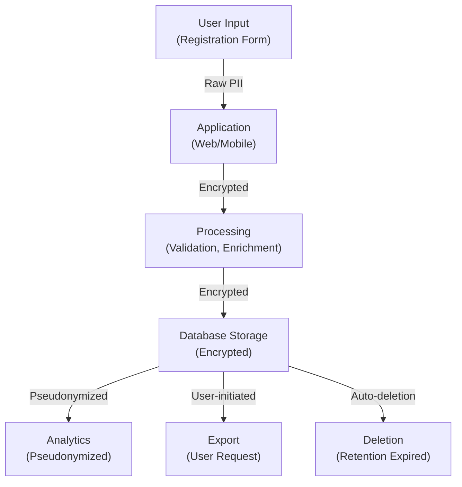

# PII Inventory & Data Classification Template

**Project**: {{PROJECT_NAME}} | **Inventory Date**: {{DATE}} | **Owner**: {{DATA_OWNER}}

**Jurisdiction**: {{JURISDICTION}} ({{APPLICABLE_LAWS}}: GDPR | CCPA | HIPAA | LGPD | etc.)

---

## Executive Summary

{{Description of PII collected, processed, and stored in the system}}

**Total PII Categories Identified**: {{COUNT}}

**High-Risk Data**: {{COUNT}} categories requiring encryption/masking

**Status**:
- ✓ All data classified
- ✓ Access controls documented
- ✓ Retention policies defined
- ✓ Deletion procedures in place

---

## Data Inventory

### Category 1: {{DATA_CATEGORY}}

| Property | Value |
|----------|-------|
| **Definition** | {{What is this data?}} |
| **Examples** | {{Specific examples}} |
| **Classification** | ⚠️ RESTRICTED | 🟠 CONFIDENTIAL | 🟢 INTERNAL | PUBLIC |
| **Collected From** | {{Source}} (User input, Third-party API, etc.) |
| **Purpose** | {{Why is this data collected?}} |
| **Legal Basis** | {{Consent | Contract | Legal obligation | Legitimate interest}} |
| **Processors** | {{Teams/Systems that access this data}} |

### Storage & Protection

| Aspect | Details |
|--------|---------|
| **Database Table** | `{{schema}}.{{table}}` |
| **Column Name** | {{column}} |
| **Data Type** | {{type}} |
| **Encryption at Rest** | ✓ AES-256 | ⚠️ Partial | ✗ No |
| **Encryption in Transit** | ✓ TLS 1.3 | ⚠️ TLS 1.2 | ✗ No |
| **Access Control** | {{Who can access?}} — Roles: {{Role1}}, {{Role2}} |
| **Audit Logging** | ✓ Every access logged | ⚠️ Sampled | ✗ Not logged |

### Data Handling

| Aspect | Value |
|--------|-------|
| **Retention Period** | {{Duration}} (Legal basis: {{REASON}}) |
| **Retention Trigger** | {{When does retention start?}} |
| **Deletion Method** | {{Crypto-shred | Overwrite | Secure disposal}} |
| **Archival** | {{Archived for}} {{DURATION}} before deletion |
| **Backup** | Included in backups? ✓ Yes | ✗ No |
| **Right to Erasure** | ✓ Implemented | ⚠️ Manual process | ✗ Not implemented |

### Risk Assessment

| Risk | Severity | Mitigation |
|------|----------|-----------|
| {{Risk}} | {{HIGH/MEDIUM/LOW}} | {{Mitigation}} |
| {{Risk}} | {{HIGH/MEDIUM/LOW}} | {{Mitigation}} |

**Example Risk**: Unauthorized database access → Customer PII exposed
- Mitigation: Network access restricted, audit logging enabled, encryption at rest

---

### Category 2: {{DATA_CATEGORY}}

**Definition**: {{Description}}

**Examples**: {{Example values}}

**Classification**: {{RESTRICTED / CONFIDENTIAL / INTERNAL / PUBLIC}}

**Database Table**: `{{schema}}.{{table}}`

**Encryption at Rest**: ✓ AES-256 | ⚠️ Partial | ✗ No

**Access Control**: {{Who can access?}}

**Retention**: {{Duration}}

**Deletion Method**: {{Method}}

---

## Data Flow Diagram



**Where PII is Created, Accessed, Transferred**:
1. {{Location}}: {{Who accesses?}}, {{Why?}}, {{When?}}
2. {{Location}}: {{Who accesses?}}, {{Why?}}, {{When?}}
3. {{Location}}: {{Who accesses?}}, {{Why?}}, {{When?}}

---

## Access Control Matrix

### Who Can Access What?

| Role | Category 1 | Category 2 | Category 3 | Approval Required |
|------|-----------|-----------|-----------|---|
| Admin | ✓ R/W/D | ✓ R/W/D | ✓ R/W/D | No |
| Developer | ✓ R (prod) | ⚠️ R (staging) | ✗ No | No |
| Customer Support | ✓ R/W | ✓ R/W | ✗ No | No |
| Analytics | ✗ No | ✗ No | ✓ R (anonymized) | No |
| Customer (own data) | ✓ R | ✓ R | ✗ No | No |

**Legend**: R = Read, W = Write, D = Delete, ✓ = Allowed, ⚠️ = Restricted, ✗ = Denied

### Data Access Audit

**Last Access Review**: {{Date}}

**Access Changes in Last 30 Days**:
1. {{Access change}} — {{Date}}, {{Approved by}}
2. {{Access change}} — {{Date}}, {{Approved by}}

**Stale Access** (should be revoked):
- {{User/Role}} accessing {{Category}} (not used for {{Days}} days) — Revoke? ✓

---

## Third-Party Data Sharing

### Processors & Sub-Processors

| Vendor | Service | Data Categories | Legal Agreement | Compliance |
|--------|---------|---|---|---|
| {{Vendor}} | {{Service}} | {{Categories}} | ✓ DPA | SOC2 |
| {{Vendor}} | {{Service}} | {{Categories}} | ✓ DPA | ISO27001 |
| {{Vendor}} | {{Service}} | {{Categories}} | ⚠️ Outdated | Custom |

**Finding**: {{Vendor}}'s DPA expires {{Date}} — {{Renew before expiry}}

### Data Processing Agreements (DPA)

**In Place For**:
- ✓ {{Vendor 1}} — signed {{Date}}
- ✓ {{Vendor 2}} — signed {{Date}}
- ⚠️ {{Vendor 3}} — pending signature since {{Date}}

**Missing DPA**:
- ✗ {{Vendor}} — {{Action required and deadline}}

---

## Retention & Deletion Policies

### Retention Schedule

| Data Category | Retention Duration | Legal Basis | Start Date | Deletion Method |
|---|---|---|---|---|
| User profile | 2 years after account deletion | {{Reason}} | {{Start trigger}} | Crypto-shred |
| Transaction logs | 10 years | {{Regulatory}} | {{Start trigger}} | {{Method}} |
| Session tokens | 30 days (inactive) | {{Reason}} | {{Start trigger}} | Overwrite |
| Audit logs | 3 years | {{Regulatory}} | {{Start trigger}} | Archive then delete |
| Support tickets | 5 years | {{Reason}} | {{Start trigger}} | {{Method}} |

### Automatic Deletion

**Implemented**:
```python
# src/tasks/data-retention.py
def cleanup_expired_data():
    """Delete data past retention date"""
    # Find records older than retention threshold
    expired = db.query(UserProfile).filter(
        UserProfile.deleted_at < (now() - 2.years)
    )
    # Securely delete
    for record in expired:
        crypto_shred(record)
    log(f"Deleted {len(expired)} expired profiles")
```

**Schedule**: Runs daily at {{TIME}} UTC

**Audit Log**: Verify deletion at `/admin/data-deletion-logs`

---

## User Data Rights (GDPR/CCPA)

### Right of Access

**User Request**: "Give me all my data"

**Process**:
1. Verify identity (email confirmation)
2. Compile all PII: {{Categories}}
3. Export as JSON/CSV
4. Send to user email
5. Log request and completion
6. Retain request log for {{DURATION}}

**Response SLA**: {{DAYS}} days (legally required: 30 days max)

**Code Location**: `api/users/:id/data-export`

**Status**: ✓ Implemented | ⚠️ Manual | ✗ Not implemented

---

### Right to Erasure

**User Request**: "Delete all my data"

**Process**:
1. Verify identity
2. Confirm intention (email confirmation)
3. Identify all PII: {{Categories}}
4. Cascade delete records
5. Crypto-shred database records
6. Purge from backups ({{Retention}} days)
7. Log erasure request and completion
8. Send confirmation email

**Response SLA**: {{DAYS}} days (legally required: 30 days max)

**Code Location**: `api/users/:id/delete-account`

**Implementation**:
```python
# src/services/user_deletion.py
async def delete_user_data(user_id):
    """Permanently delete user and all associated PII"""
    user = db.query(User).get(user_id)

    # Delete associated records
    db.query(UserProfile).filter_by(user_id=user_id).delete()
    db.query(Transaction).filter_by(user_id=user_id).delete()
    db.query(AuditLog).filter_by(user_id=user_id).delete()

    # Crypto-shred the user record
    db.delete(user)
    db.commit()

    # Log the deletion
    audit_log(f"User {user_id} fully erased per GDPR")

    # Notify user
    send_email(user.email, "Your data has been deleted")
```

**Status**: ✓ Implemented | ⚠️ Manual process | ✗ Not implemented

---

### Right to Portability

**User Request**: "Give me my data in portable format"

**Implementation**:
- ✓ JSON export available
- ✓ CSV export available
- ✓ PDF export available
- ⚠️ XML export (partial)
- ✗ API export not available

**Code Location**: `api/users/:id/data-export`

---

### Right to Rectification

**User Request**: "Fix incorrect data"

**Process**:
1. User submits correction request
2. Support team verifies request
3. Data updated
4. Audit log records change (before/after values)
5. Amendment log created (GDPR requirement)

**Amendment Tracking**:
```sql
-- Table: user_amendments
-- Tracks all user-requested corrections
CREATE TABLE user_amendments (
    id UUID,
    user_id UUID,
    field_name VARCHAR,
    old_value TEXT,
    new_value TEXT,
    requested_at TIMESTAMP,
    completed_at TIMESTAMP,
    requested_by_user BOOLEAN
);
```

---

## Data Minimization

**Principle**: Collect only necessary PII

**Audit**: Is each data element necessary for stated purpose?

| Data Element | Collected | Necessary? | Can be Deleted? | Action |
|---|---|---|---|---|
| {{Element}} | ✓ Yes | ✓ Yes | ✗ No | Keep |
| {{Element}} | ✓ Yes | ⚠️ Maybe | ✓ Yes | Evaluate deletion |
| {{Element}} | ✓ Yes | ✗ No | ✓ Yes | **Delete** |

**Finding**: Birthday collected but not used — Delete field and purge from database

---

## Data Subject Rights Requests

### Tracking

| Request ID | User | Type | Submitted | Deadline | Completed | Status |
|---|---|---|---|---|---|---|
| DSR-001 | user@example.com | Access | 2024-01-15 | 2024-02-14 | 2024-01-20 | ✓ Complete |
| DSR-002 | user@example.com | Erasure | 2024-01-16 | 2024-02-15 | Pending | ⏳ In progress |

**Dashboard**: `/admin/dsr-requests`

---

## Breach Notification Procedures

**If PII is Compromised**:

1. **Identify breach**: {{Who detects it?}}, {{How?}}
2. **Contain**: {{Actions to stop data loss}}
3. **Notify leadership**: Within {{HOURS}}
4. **Legal review**: Within {{HOURS}}
5. **Notify affected users**: Within {{DAYS}} (GDPR: 72 hours)
6. **Notify authorities**: If high risk, notify {{Authority}} within {{DAYS}}
7. **Root cause analysis**: Complete within {{DAYS}}
8. **Remediation**: Implement by {{DAYS}}

**Breach Notification Template**:
```
Subject: Notice of Unauthorized Access to Your Data

Dear {{USER}},

We are writing to inform you of a security incident that may have affected
your personal information.

Incident: {{Description}}
Date Discovered: {{Date}}
Data Affected: {{Categories}}
Your Impact: {{Risk assessment}}

Actions Taken: {{Remediation steps}}

What You Can Do: {{Recommendations}}

Contact: {{Email/phone for questions}}
```

**Notification Log**: `docs/breach-notifications.md`

---

## Compliance Checklist

- [ ] All PII categories identified and documented
- [ ] Classification scheme applied to all data
- [ ] Encryption at rest implemented (AES-256 minimum)
- [ ] Encryption in transit implemented (TLS 1.2+)
- [ ] Access controls documented and enforced
- [ ] Retention policies defined and implemented
- [ ] Automatic deletion scheduled and working
- [ ] User rights (access, erasure, portability) implemented
- [ ] Data Processing Agreements in place
- [ ] Breach notification procedures documented
- [ ] Audit logging enabled for all PII access
- [ ] Annual review of PII inventory scheduled
- [ ] Privacy Impact Assessment completed
- [ ] Third-party risk assessments completed

---

## Annual Review

**Last Review**: {{DATE}}

**Next Scheduled Review**: {{DATE}}

**Changes Since Last Review**:
1. {{Change}}: {{Date added}}, Impact: {{High/Medium/Low}}
2. {{Change}}: {{Date added}}, Impact: {{High/Medium/Low}}

**Recommendations**:
1. {{Recommendation}}: {{Timeline}}
2. {{Recommendation}}: {{Timeline}}

---

## Data Protection Officer

**DPO Contact**: {{Name}} ({{Email}}) — {{Slack}}

**Questions About PII**: Reach out to {{SLACK_CHANNEL}}

**Privacy Incident Report**: File at {{URL}} or email {{EMAIL}}

---

## References

- **Privacy Policy**: {{LINK}}
- **Data Processing Agreement**: {{LINK}}
- **Retention Policy**: {{LINK}}
- **Encryption Standards**: {{LINK}}
- **GDPR Compliance Guide**: {{LINK}}

---

**Inventory Version**: {{VERSION}} | **Date**: {{DATE}} | **Owner**: {{OWNER}} | **Status**: {{CURRENT | OUTDATED}}

**Next Review**: {{DATE}}
