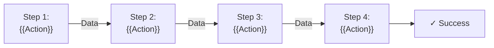
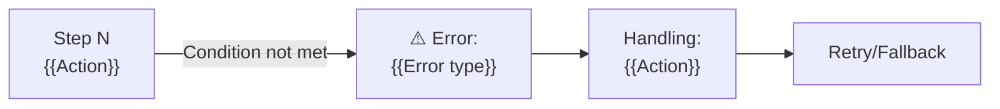
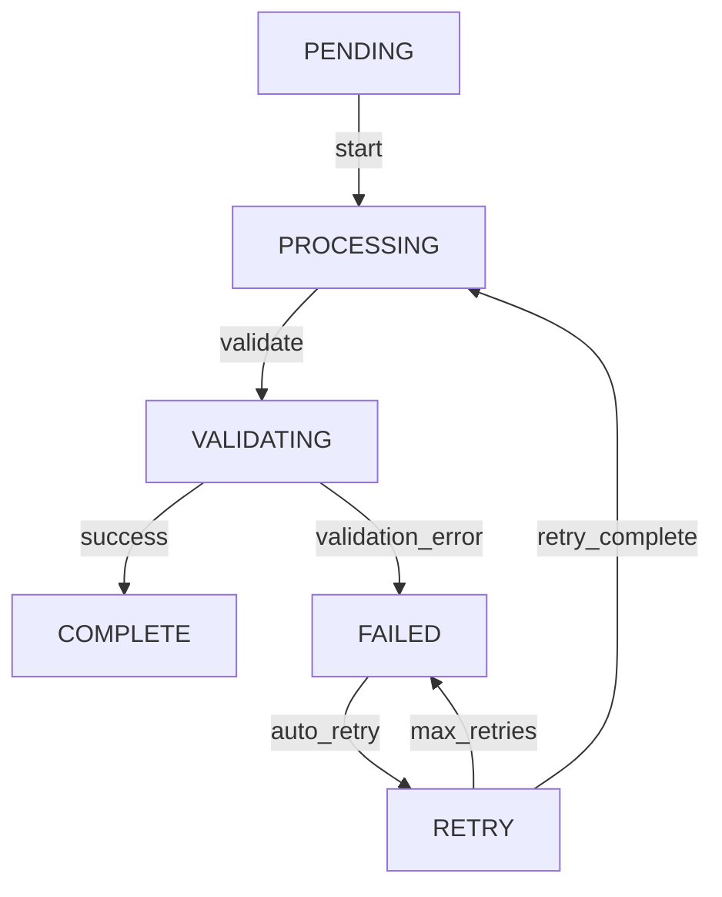

# Workflow Documentation Template

**Workflow Name**: {{WORKFLOW_NAME}} | **Version**: {{VERSION}} | **Last Updated**: {{DATE}}

**Category**: {{USER_FLOW | BATCH_PROCESS | ASYNC_JOB | PAYMENT_FLOW | DATA_SYNC | etc.}}

---

## Overview

{{2-3 sentence description of what this workflow does and why it's important}}

**Business Value**: {{What business problem does this solve?}}

**Frequency**: {{On-demand | Hourly | Daily | Weekly | Per event | Per transaction}}

**SLA**: {{Response time}}, {{Availability}}, {{Error rate threshold}}

---

## Happy Path

The primary, successful flow through the system.



### Step-by-Step Breakdown

**Step 1: {{STEP_NAME}}**

**Actor**: {{Who initiates?}} (User, System, Scheduled job)

**Trigger**: {{What causes this step?}}

**Input**:
```json
{
  "{{field}}": "{{type}}: {{description}}",
  "{{field}}": "{{type}}: {{description}}"
}
```

**Processing**: {{What happens in this step?}}

**Output**:
```json
{
  "{{field}}": "{{type}}: {{result}}",
  "{{field}}": "{{type}}: {{result}}"
}
```

**Code Location**: `src/{{path}}/{{file}}.{{ext}}`

**Duration**: {{EXPECTED_TIME}} (P50), {{P99_TIME}} (P99)

---

**Step 2: {{STEP_NAME}}**

**Actor**: {{Who/what executes?}}

**Trigger**: {{Triggered after Step 1 succeeds}}

**Input**: {{From Step 1}}

**Processing**: {{Business logic}}

**Output**: {{Result}}

**Code Location**: `src/{{path}}`

**Duration**: {{TIME}}

---

**Step 3: {{STEP_NAME}}**

**Actor**: {{Who/what}}

**Trigger**: {{When?}}

**Processing**: {{What happens?}}

**Validation**: {{What must be true?}}

**Code Location**: `src/{{path}}`

---

**Step 4: {{STEP_NAME}}**

**Actor**: {{Who/what}}

**Trigger**: {{When?}}

**Processing**: {{What happens?}}

**Side Effects**:
- Database update: {{What changes?}}
- Notification sent: {{To whom, what message?}}
- Webhook triggered: {{Webhook URL, event type}}

**Code Location**: `src/{{path}}`

---

### Key Decisions in Happy Path

| Decision Point | Condition | Outcome |
|---|---|---|
| {{Decision}} | {{If condition}} | {{Then action}} |
| {{Decision}} | {{If condition}} | {{Then action}} |

**Example Decision**:
```
"Is user premium?"
  → YES: Charge premium price
  → NO: Charge standard price
```

---

## Error Paths

How the workflow handles various error conditions.

### Error 1: {{ERROR_CONDITION}}

**When It Occurs**: {{Specific condition}}

**Impact**: {{What breaks?}}

**Detection**: {{How is the error detected?}}

**Code Location**: `src/{{path}}`, line {{LINE}}



**Handling Strategy**: {{Retry | Fallback | Fail gracefully | Escalate}}

**Retry Logic**:
```javascript
// Retry up to 3 times with exponential backoff
const config = {
  maxRetries: 3,
  backoff: 'exponential',
  initialDelay: 100,  // ms
  maxDelay: 5000      // ms
};
```

**Fallback**: {{If retries fail, what happens?}}

**User Impact**: {{What does the user see?}}

**Code Location**: `src/{{path}}`

---

### Error 2: {{ERROR_CONDITION}}

**When It Occurs**: {{Condition}}

**Impact**: {{Impact}}

**Handling Strategy**: {{Strategy}}

**Code Location**: `src/{{path}}`

---

## Retry Flows

How the workflow recovers from transient failures.

### Automatic Retry

**Scenario**: {{Example failure that triggers retry}}

```
Attempt 1 at T+0s  → Fails with {{error}}
Attempt 2 at T+1s  → Fails with {{error}}
Attempt 3 at T+10s → Fails with {{error}}
Attempt 4 at T+100s → Fails with {{error}}

After 4 attempts: Escalate to {{handler}}
```

**Exponential Backoff**:
```
Delay: 1s, 2s, 4s, 8s, 16s, 32s (capped at 5 min)
Max attempts: 6
Timeout: 30 min (total)
```

**Code Location**: `src/{{path}}/retry-handler.js`

### Manual Retry

**When Needed**: {{Scenario that requires manual intervention}}

**How to Trigger**:
```bash
# Using CLI
npm run retry-workflow -- {{workflow_id}} --attempt=2

# Or via API
POST /api/workflows/{{workflow_id}}/retry
```

**Conditions That Prevent Auto-Retry**:
- {{Condition 1}}: {{Why?}}
- {{Condition 2}}: {{Why?}}

---

## Async Flows

How the workflow handles asynchronous operations.

### Async Operation 1: {{OPERATION}}

**Type**: {{Fire-and-forget | Acknowledge then process | Ordered delivery}}

**Trigger**: {{When does this happen?}}

**Queue/Topic**: {{Name of queue or message broker}}

**Message Format**:
```json
{
  "event_type": "{{event_name}}",
  "user_id": "{{uuid}}",
  "{{field}}": "{{value}}"
}
```

**Processing**:
- **Consumer**: `src/workers/{{worker_name}}.js`
- **Concurrency**: {{Parallel workers}}, partition by {{key}}
- **Processing Time**: {{EXPECTED_TIME}} average
- **Timeout**: {{TIMEOUT}} before marking as failed
- **Dead Letter Queue**: {{Location}}, {{Retention}}

**Completion Signal**: {{How does the initiator know it's done?}}

---

### Async Operation 2: {{OPERATION}}

**Type**: {{Type}}

**Queue**: {{Location}}

**Message Format**: {{Schema}}

**Consumer**: {{Worker location}}

**DLQ Handling**: {{How dead letters are processed}}

---

## Workflow State Machine

**Current State & Transitions**:



| State | Meaning | Timeout | Valid Transitions |
|-------|---------|---------|---|
| PENDING | Awaiting processing | 5 min | → PROCESSING |
| PROCESSING | Active processing | 30 min | → VALIDATING, FAILED |
| VALIDATING | Final validation | 5 min | → COMPLETE, FAILED |
| COMPLETE | Success | — | (terminal) |
| FAILED | Permanent failure | — | (terminal) |

**State Transitions**:
```python
# src/models/workflow_state.py
class WorkflowState(Enum):
    PENDING = "pending"
    PROCESSING = "processing"
    VALIDATING = "validating"
    COMPLETE = "complete"
    FAILED = "failed"

    def can_transition_to(self, next_state):
        valid_transitions = {
            PENDING: [PROCESSING],
            PROCESSING: [VALIDATING, FAILED],
            VALIDATING: [COMPLETE, FAILED],
            COMPLETE: [],  # Terminal
            FAILED: []     # Terminal
        }
        return next_state in valid_transitions[self]
```

---

## Performance Characteristics

### Benchmarks

```
Happy Path (100 items):
  Duration: {{TIME}}ms (P50), {{TIME}}ms (P99)
  Memory: {{MEMORY}}MB
  CPU: {{CPU}}% average

Large Batch (10,000 items):
  Duration: {{TIME}}s (P50), {{TIME}}s (P99)
  Memory: {{MEMORY}}MB
  CPU: {{CPU}}% average
```

### Scalability

| Load | Response Time | Throughput | Notes |
|------|---|---|---|
| {{LOAD}} | {{TIME}} | {{TPS}} | {{Notes}} |
| {{LOAD}} | {{TIME}} | {{TPS}} | {{Notes}} |

### Resource Usage

- **Database**: {{Queries}}, {{Connections}} opened
- **Memory**: Peak {{PEAK}}MB, average {{AVG}}MB
- **Network**: {{BANDWIDTH}} per transaction
- **Storage**: {{SIZE}} per item processed

---

## Dependencies & Interactions

### External Services Called

| Service | Endpoint | Timeout | Retry | SLA |
|---------|----------|---------|-------|-----|
| {{Service}} | `{{endpoint}}` | {{TIME}} | {{Count}} | {{Uptime}} |
| {{Service}} | `{{endpoint}}` | {{TIME}} | {{Count}} | {{Uptime}} |

**Service Degradation**: {{What happens if a service is slow/down?}}

### Database Operations

```sql
-- Queries executed in this workflow

-- 1. Fetch user data
SELECT * FROM users WHERE id = ?;

-- 2. Create transaction record
INSERT INTO transactions (user_id, amount, status) VALUES (?, ?, ?);

-- 3. Update inventory
UPDATE inventory SET quantity = quantity - ? WHERE product_id = ?;
```

### Cache Usage

- **Cache**: {{Redis / Memcached / etc.}}
- **Keys**: {{Key pattern}}, TTL: {{DURATION}}
- **Hit Rate**: {{RATE}}% typical
- **Invalidation**: {{When cache is cleared?}}

---

## Monitoring & Observability

### Key Metrics

| Metric | Target | Alert |
|--------|--------|-------|
| `workflow_duration_seconds` | {{P99}} < {{TIME}}s | > {{TIME}}s |
| `workflow_error_rate` | < {{RATE}}% | > {{RATE}}% |
| `workflow_throughput_per_min` | {{TPS}} | < {{THRESHOLD}} |

### Logging

**What Gets Logged**:
- Workflow start: user_id, input parameters
- Step completion: step_name, duration, status
- Errors: error_code, error_message, stack_trace
- Workflow end: final_status, total_duration

**Log Location**: {{CloudWatch | ELK | Datadog | etc.}}

```
[2024-01-15T10:30:00Z] WORKFLOW_START: workflow_id=wf_123, user_id=user_456
[2024-01-15T10:30:01Z] STEP_COMPLETE: step=step_1, duration=1234ms, status=success
[2024-01-15T10:30:02Z] STEP_COMPLETE: step=step_2, duration=567ms, status=success
[2024-01-15T10:30:05Z] WORKFLOW_END: status=success, total_duration=5123ms
```

### Distributed Tracing

**Trace ID**: Propagated through all steps

```
Trace: trace_abc123xyz
  Span: workflow_step_1 (1.2s)
    Span: db_query (0.5s)
    Span: api_call (0.6s)
    Span: cache_update (0.1s)
  Span: workflow_step_2 (0.8s)
```

---

## Testing

### Happy Path Test

```javascript
describe('Workflow: {{WORKFLOW_NAME}}', () => {
  it('should complete successfully', async () => {
    // Arrange
    const input = { {{test_data}} };

    // Act
    const result = await workflow.execute(input);

    // Assert
    expect(result.status).toBe('complete');
    expect(result.{{field}}).toEqual({{expected}});
  });
});
```

### Error Path Tests

```javascript
it('should handle {{error}} gracefully', async () => {
  // Arrange: Mock a failure condition
  mockService.willThrowError('{{error}}');
  const input = { {{test_data}} };

  // Act
  const result = await workflow.execute(input);

  // Assert
  expect(result.status).toBe('failed');
  expect(result.error_code).toBe('{{ERROR_CODE}}');
});
```

### Performance Tests

```javascript
it('should complete within {{TIME}}ms for {{LOAD}}', async () => {
  const start = performance.now();
  const result = await workflow.execute(largeInput);
  const elapsed = performance.now() - start;

  expect(elapsed).toBeLessThan({{TIME}});
});
```

---

## Known Issues & Workarounds

| Issue | Impact | Workaround | Fix Timeline |
|---|---|---|---|
| {{Issue}} | {{Impact}} | {{Workaround}} | {{Timeline}} |

---

## Operational Runbook

### Normal Execution

```bash
# Start workflow
curl -X POST https://api.example.com/workflows \
  -d '{"type": "{{WORKFLOW_NAME}}", "user_id": "{{uid}}"}'

# Check status
curl https://api.example.com/workflows/{{workflow_id}}

# Expected output
{
  "status": "complete",
  "started_at": "2024-01-15T10:30:00Z",
  "completed_at": "2024-01-15T10:30:05Z",
  "result": {{result}}
}
```

### Troubleshooting: Workflow Stuck in PROCESSING

**Symptoms**: Workflow in PROCESSING state for > 30 min

**Diagnosis**:
```bash
# Check workflow logs
kubectl logs -f deployment/workflow-processor -n prod

# Check service status
curl https://api.example.com/health

# Check for blocked transactions
SELECT * FROM {{table}} WHERE status = 'PROCESSING' AND updated_at < NOW() - INTERVAL '30 minutes';
```

**Resolution**:
1. Identify blocked resource (database lock, external service down, etc.)
2. Resolve the blocker
3. Either workflow auto-completes, or manually retry

---

### Troubleshooting: High Error Rate

**Symptoms**: > 5% of workflows failing

**Investigation**:
```
1. Check error logs for common error_code
2. Check if external service is degraded
3. Check if database has high latency
4. Check for recent code deployments
```

**Common Causes**:
- {{Cause 1}}: {{How to verify}}, {{Fix}}
- {{Cause 2}}: {{How to verify}}, {{Fix}}

---

## Related Workflows

| Workflow | Relationship | Interaction |
|----------|---|---|
| {{Workflow}} | {{Precursor / Follow-up / Alternative}} | {{How they interact}} |

---

## Version History

| Version | Changes | Date | Author |
|---------|---------|------|--------|
| 2.0 | {{Change description}} | {{Date}} | {{Author}} |
| 1.0 | Initial implementation | {{Date}} | {{Author}} |

---

**Workflow Documentation**: {{VERSION}} | **Updated**: {{DATE}} | **Owner**: {{TEAM}} | **Status**: {{ACTIVE | DEPRECATED}}
