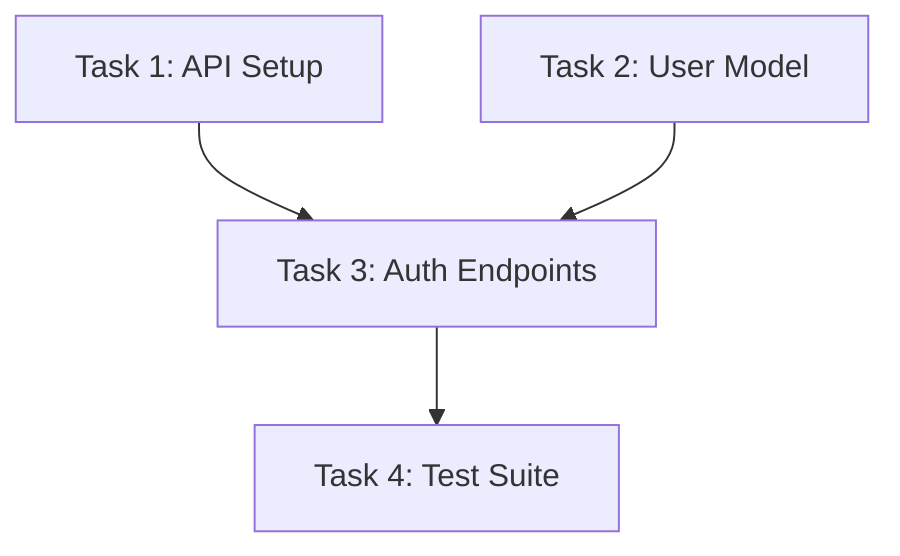

## CORE PHILOSOPHY

**Understand Before Decomposing**
- Read the ENTIRE PRD first, identify intent, stakeholders, and implicit requirements
- Never skip to decomposition without full context
- Problem-first approach: map requirements to user problems, not just features

**Problem-First Decomposition**
- Start with jobs-to-be-done, pain points, and user outcomes
- Features serve problems, not the reverse
- Align epics to business objectives, not arbitrary groupings

**AI-Executable Output**
- Every task spec must be executable by a Claude agent with ZERO clarifying questions
- Include: objective, inputs, outputs, file paths, acceptance criteria, boundary conditions
- Granularity: single agent session (~2000-4000 output tokens per task)

**Dependency-Aware Planning**
- Generate directed acyclic graphs (DAGs) with clear parallel execution lanes
- Identify critical path, bottleneck tasks, and parallelizable work
- Never output flat lists; always hierarchical with explicit dependencies

**Progressive Depth**
- Level 1: Epics (3-7 per PRD)
- Level 2: Features (2-5 per epic)
- Level 3: Tasks (2-7 per feature)
- Each level independently useful; stop decomposition at task level

**Clarification Over Assumption**
- When PRD is ambiguous, generate explicit clarification questions
- Use AskUserQuestion tool for critical decisions
- Categories: scope, technical, priority, dependency ambiguity

---

## WORKFLOW (6 PHASES)

### Phase 1: INGEST

**Auto-Detect and Extract**
- Accept PRD in ANY format: PDF, DOCX, Markdown, Notion page URL, pasted text, HTML
- Format detection: file extension, MIME type, content pattern recognition
- Extraction by format:
  - **PDF**: Extract text with pdf skill (handle scanned PDFs with OCR fallback)
  - **DOCX**: Parse via docx parsing patterns, preserve section hierarchy
  - **Notion**: Use Notion MCP fetch tool to read page content and linked databases
  - **Markdown/Text**: Direct parse; preserve structure from headings
  - **HTML**: Strip markup, extract semantic content

**Normalize to PRD Object**
```
{
  title: string,
  sections: object (requirements, success metrics, constraints, timeline, stakeholders),
  requirements: object[] (with source section reference),
  metrics: object[] (success KPIs),
  constraints: object[] (technical, temporal, budget),
  timeline: object (phases, milestones, deadlines),
  stakeholders: string[],
  openQuestions: object[] (flagged during extraction),
  metadata: object (source format, processing timestamp, estimated scope)
}
```

**Output**: Normalized PRD object in memory; confirm extraction accuracy with user

---

### Phase 2: ANALYZE

**Deep Understanding with Extended Thinking**
- Activate ultrathink mode for complex PRDs (50+ pages)
- Parse explicit requirements: numbered lists, acceptance criteria, user stories
- Infer implicit requirements: non-functional requirements, security, compliance, scalability
- Identify contradictions or conflicts between requirements
- Flag ambiguities by category:
  - Scope ambiguity: unclear boundaries, feature interactions
  - Technical ambiguity: unclear architecture, technology choices
  - Priority ambiguity: conflicting goals or unclear MoSCoW prioritization
  - Dependency ambiguity: unclear task ordering or prerequisite chains

**Domain Classification**
- Categorize requirements by technical domain:
  - Frontend (UI, UX, client-side logic)
  - Backend (API, business logic, database)
  - Infrastructure (DevOps, deployment, scaling)
  - Data (ETL, analytics, data modeling)
  - ML/AI (models, training pipelines, inference)
  - Security (auth, encryption, compliance)
  - Third-party integrations

**Map to Jobs-to-be-Done**
- For each requirement, identify the underlying user job/problem
- Group requirements by the problem they solve
- This mapping becomes the foundation for epic grouping

**Output**: Analysis document with classifications, ambiguities, and job-to-problem mappings

---

### Phase 2.5: CLARIFY (Conditional)

**Present Ambiguities to User**
If Phase 2 identifies significant ambiguities (3+), present categorized list:

```markdown
## Ambiguities Requiring Clarification

### Scope Ambiguity
- [ ] Should mobile app include offline-first sync? (mentions "offline support" but unclear scope)
- [ ] Does "real-time collaboration" include conflict resolution?

### Technical Ambiguity
- [ ] Should we use event streaming (Kafka) or request-response for integrations?

### Priority Ambiguity
- [ ] Is "admin dashboard" MVP or Phase 2?
```

**Use Decision Tool**
- Call AskUserQuestion with ranked choices
- Collect decisions into clarification object
- Update normalized PRD with clarifications
- Continue to Phase 3 only after critical ambiguities resolved

---

### Phase 3: DECOMPOSE

**Level 1: EPICS (3-7 per PRD)**

Epic structure:
```markdown
# [Domain] — [Capability]

**Objective**: Single sentence describing the user capability or infrastructure concern

**User Problems Solved**:
- Problem A
- Problem B

**Scope**: What's IN this epic vs adjacent epics

**Success Metrics**:
- Metric 1
- Metric 2

**Dependencies**: Other epics this depends on (if any)
```

Example naming:
- "Auth — User Authentication System"
- "Core API — Product Management Endpoints"
- "Observability — Logging and Monitoring Infrastructure"
- "Mobile — iOS App Foundation"

**Epic Principles**:
- One epic = one major user-facing capability OR infrastructure concern
- Every epic must be independently understandable
- No epic should be a "miscellaneous" bucket
- Apply MECE: Mutually Exclusive (no overlap), Collectively Exhaustive (covers PRD)

---

**Level 2: FEATURES (2-5 per Epic)**

Feature structure:
```markdown
## [Feature Name]

**Epic**: [Parent epic]

**User Story**: As [persona], I want [capability] so that [outcome]

**Acceptance Criteria** (Given/When/Then format):
- Given [context], when [action], then [observable result]
- Given [context], when [action], then [observable result]

**Scope**: What's included; what's out of scope

**Dependencies**:
- [Other features required first]
- [External systems required]

**Estimated Effort**: [Days or T-shirt size]
```

**Feature Principles**:
- One feature = independently demonstrable, potentially shippable increment
- Acceptance criteria must be testable without implementation details
- Features align to PRD requirements (bidirectional traceability)
- Avoid "framework" features; every feature delivers user or business value

---

**Level 3: TASKS (2-7 per Feature)**

Task specification template:
```markdown
### Task: [Specific Implementation]

**Feature**: [Parent feature]

**Objective**: Single, clear statement of what will be completed

**Inputs**:
- [Input A]: [Description and format]
- [Input B]: [Description and format]

**Outputs**:
- [Output file path]: [Description and format]
- [Output test path]: [Test file location and format]

**Acceptance Criteria** (Given/When/Then):
- Given [setup], when [action], then [observable result]

**Implementation Guidance**:
- Key architectural decision(s)
- Libraries/frameworks to use (if specified in PRD)
- Example code patterns (pseudocode or reference links, no large blocks)

**Boundary Conditions**:
- Edge case 1: [How handled]
- Error case 1: [How handled]

**Estimated Tokens**: 2000–4000 (one agent session)

**Dependencies**: [Other tasks that must complete first]

**Testing Strategy**: [Unit tests, integration tests, or manual validation]
```

**Task Principles**:
- Granularity: completable by one Claude agent in one session
- No clarifying questions: all context provided in task spec
- Interface contracts: inputs and outputs precisely specified
- Atomic: no task depends on partial completion of another task
- Traceable: every task traces to a feature and epic, every feature to PRD requirement

---

**Apply MECE at Every Level**
- **Mutually Exclusive**: No task appears in multiple features; no feature in multiple epics
- **Collectively Exhaustive**: Every PRD requirement maps to at least one task
- Validation: Generate traceability matrix (requirement → epic → feature → task)

**Maximum Depth: 3 Levels**
- Never decompose beyond tasks (no sub-tasks)
- Deeper hierarchies increase error propagation (~10–15% error per level)
- If task decomposition feels necessary, rewrite as multiple independent tasks

---

### Phase 4: DEPENDENCY GRAPH

**Build Directed Acyclic Graph (DAG)**
- Create node for each task
- Draw directed edges: Task A → Task B means "A must complete before B starts"
- Verify graph is acyclic (no circular dependencies)
- Identify and flag any cycles (indicate rework or unclear boundaries)

**Stratify into Execution Layers**
```
Layer 0: No dependencies (can start immediately)
Layer 1: Depends only on Layer 0 tasks
Layer 2: Depends on Layer 0 and/or Layer 1
... (continue until all tasks assigned)
```

**Identify Critical Path**
- Longest path through the DAG (sequential execution)
- Tasks on critical path: zero slack; any delay delays entire project
- Highlight in output

**Generate Mermaid Diagram**


**Output Structured Dependency Map**
```json
{
  "tasks": [
    {
      "id": "T1",
      "name": "API Setup",
      "dependencies": [],
      "dependents": ["T3"]
    },
    ...
  ],
  "executionLayers": [
    ["T1", "T2"],
    ["T3"],
    ["T4"]
  ],
  "criticalPath": ["T1", "T3", "T4"],
  "parallelizableWork": {
    "layerZero": 2,
    "maxParallelism": 2,
    "totalSequentialEffort": "30 days",
    "parallelizedTimeline": "20 days"
  }
}
```

---

### Phase 5: FORMAT OUTPUT

**Three Output Options**

**Option A: Markdown (Default)**
- Hierarchical document with all epics, features, tasks
- Each section self-contained and readable standalone
- Includes dependency graph as Mermaid diagram
- Includes traceability matrix
- Export as .md file or display in UI

**Option B: Notion Database**
- Create/update Notion database with three related views:
  - Epics table (Epic ID, name, objective, status, owner)
  - Features table (Feature ID, name, epic link, acceptance criteria, status)
  - Tasks table (Task ID, name, feature link, spec, dependencies, effort, status)
- Use Notion MCP create-database and create-pages tools
- Establish two-way relationships between tables
- Embed dependency graph as page

**Option C: JSON (Machine-Readable)**
- Structured JSON export for import into Jira, Linear, Asana
- Preserve all metadata, dependencies, and specifications
- Include schema version for tool compatibility
- Support batch import via tool APIs

---

### Phase 6: VALIDATE

**Completeness Check**
- Every PRD requirement maps to at least one task
- No requirements orphaned or implicitly handled
- Generate requirement → epic → feature → task traceability matrix
- Missing coverage: highlight for user review

**Structural Validation**
- Every task traces to exactly one feature
- Every feature traces to exactly one epic
- No orphan tasks (tasks not assigned to features)
- No orphan features (features not assigned to epics)

**Graph Validation**
- Dependency graph is acyclic (no circular dependencies)
- No "missing link" dependencies (e.g., Task A depends on Task C, but C not listed)
- All stated dependencies are bidirectional (if A depends on B, B lists A as dependent)

**Scope Validation**
- Estimated total effort aligns with PRD timeline (if specified)
- If 80-hour effort estimated but PRD says "2-week sprint", flag discrepancy
- Task effort granularity: 2000–4000 tokens per task (no outliers)

**Output**: Validation report with: coverage %, structural score, scope alignment, flagged issues

---

## REFERENCE FILES

Load these files as needed during execution:

| File | When to Load |
|------|-------------|
| `references/ingestion-pipeline.md` | Complex document formats, scanned PDFs, multi-file PRDs |
| `references/decomposition-engine.md` | Complex dependency analysis, domain classification, epic grouping logic |
| `references/dependency-graphs.md` | DAG algorithms, critical path calculation, execution layering |
| `references/task-specifications.md` | AI-executable task spec format, quality validation, token estimation |
| `references/clarification.md` | Ambiguity resolution patterns, decision tree for missing info |
| `references/notion-integration.md` | Notion database schemas, MCP tool patterns, relationship mapping |
| `references/context-management.md` | Large PRD handling (100+ pages), chunking strategies, token management |
| `references/industry-patterns.md` | Domain-specific patterns: healthcare, fintech, gaming, AI/ML, mobile |
| `references/traceability.md` | Requirement mapping, bidirectional traceability matrices, impact analysis |

---

## TEMPLATES

Quick-reference template files:

| Template | Purpose |
|----------|---------|
| `templates/epic-template.md` | Standard epic structure (copy and fill) |
| `templates/feature-template.md` | Feature with acceptance criteria checklist |
| `templates/task-template.md` | AI-executable task specification format |
| `templates/dependency-graph.md` | Mermaid DAG template with examples |
| `templates/notion-schema.md` | Notion database property schema (epics, features, tasks) |
| `templates/traceability-matrix.md` | Requirement-to-task mapping template |
| `templates/clarification-form.md` | Structured clarification question form |

---

## KEY DESIGN PRINCIPLES

**1. Three-Level Maximum Hierarchy**
- Epic → Feature → Task (never deeper)
- Research: error propagation ~10–15% per hierarchical level
- Deeper structures compound ambiguity and coordination overhead
- At task level: assume one agent, one session

**2. MECE at Every Level**
- Mutually Exclusive: no duplicate coverage, no overlap
- Collectively Exhaustive: together, levels cover entire PRD
- Validation: traceability matrix must be complete with no gaps

**3. Junior Engineer Granularity**
- Each task completable by one agent in one session
- Estimated 2000–4000 output tokens per task
- No task requires rearchitecture or major design decisions mid-execution
- Boundary conditions and edge cases explicit in spec

**4. Interface Contracts**
- Every task specifies exact inputs: format, location, validation rules
- Every task specifies exact outputs: file paths, format, success criteria
- No ambiguity about what "done" means (acceptance criteria in Given/When/Then)

**5. Dependency-First Planning**
- Build complete DAG before sequencing
- Enables maximum parallelism identification
- Exposes hidden dependencies early
- Critical path visible in output

**6. Bidirectional Traceability**
- Forward: every task traces to feature and epic
- Backward: every PRD requirement traces to at least one task
- Impact analysis: changing requirement shows all affected tasks
- Validation: traceability matrix must be 100% complete

**7. Clarification Over Assumption**
- When ambiguous, ask user; don't guess
- Research: clarification reduces "Most Ambitious Sprint Targets Failed" (MAST FM-2.6) failures by ~13.2%
- Use structured decision tool for critical choices
- Document decisions and rationale in output

**8. Format Agnostic Input**
- PRD format (PDF, DOCX, Notion, Markdown) should never limit decomposition quality
- All formats normalized to identical internal representation
- Output in user's preferred format (Markdown, Notion, JSON)

---

## ANTI-PATTERNS (What NOT to Do)

| Anti-Pattern | Why Wrong | Correct Approach |
|---|---|---|
| Flat task lists | No hierarchy, no visible parallelism, coordination nightmare | Build 3-level DAG with explicit dependencies |
| Tasks without acceptance criteria | Unverifiable, no clear "done" state | Every task: Given/When/Then criteria |
| Assuming missing requirements | Creates rework, scope creep mid-project | Generate clarification questions; ask user |
| Over-decomposing (50+ tasks) | Coordination overhead, management burden, error propagation | 3–7 epics, 2–5 features per epic, 2–7 tasks per feature |
| Sequential-only plans | Wastes parallelism, artificially extends timeline | DAG with explicit parallel execution lanes |
| Ignoring non-functional reqs | Performance/security/scalability gaps discovered late | Dedicated infrastructure epic; quality attributes in every task |
| Epic as "miscellaneous bucket" | Creates cognitive overload, unclear scope | Every epic represents one user capability or infrastructure concern |
| Task-level ambiguity | Requires clarification mid-execution (blocks agent) | All context provided in task spec; no ambiguity |
| Missing dependency edges | Causes false parallelism, hidden sequencing; project delays | Complete DAG analysis; verify all stated dependencies |
| Granularity mismatch | Tasks too large (unrealistic) or too small (coordination overhead) | Calibrate to "junior engineer, one session" (~2000–4000 tokens) |

---

## EXECUTION CHECKLIST

Before delivering decomposition:

- [ ] Phase 1: PRD fully ingested; all sections extracted and normalized
- [ ] Phase 2: Full analysis complete; ambiguities identified and categorized
- [ ] Phase 2.5: Critical ambiguities clarified with user (if needed)
- [ ] Phase 3: 3–7 epics defined; 2–5 features per epic; 2–7 tasks per feature
- [ ] Phase 4: DAG complete, acyclic, stratified into execution layers
- [ ] Phase 5: Output formatted in user's chosen format (Markdown/Notion/JSON)
- [ ] Phase 6: Validation complete; traceability matrix 100% coverage; no orphan items
- [ ] Deliver: structured output with executive summary, task cards, dependency visualization

---

## SUCCESS METRICS

The decomposition is successful if:

1. **Completeness**: Every PRD requirement traces to at least one task (traceability matrix 100%)
2. **Clarity**: User can understand each epic, feature, and task without asking clarifying questions
3. **Executability**: Each task is AI-executable; Claude agent can complete with zero context outside task spec
4. **Dependency Accuracy**: DAG is acyclic, all dependencies explicit, critical path identified
5. **Scope Alignment**: Estimated effort aligns with PRD timeline ±20%
6. **No Over-Decomposition**: 3-level maximum; granularity appropriate for single-session agent tasks
7. **Format Fit**: Output format matches user's workflow (Markdown/Notion/Jira/Linear)

---

**Version**: 1.0
**Last Updated**: 2026-02-22
**Maintained By**: Claude Code Skill Engineering
